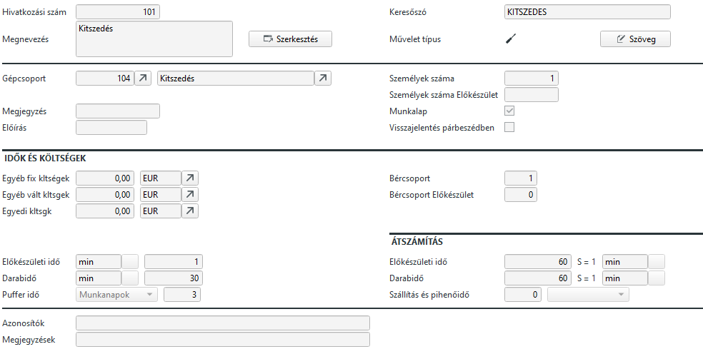

# Műveletek

A műveletek a gyártási lista elemeként jelenik meg. Rendkívül fontos eleme, nélküle nincs visszajelentés sem.
Minden művelet aminél a munkalap mező be van állítva, a gyártási listában egy munkalapot képez, amihez alapanyagok tartoznak.

Fontos, hogy a gyártási lista Műveletre végződjön.

Keresőszava 30 karakter hosszú lehet, a megnevezése pedig többnyelvű.

## Gépcsoport

Olvassa el a [Kapacitások](kapacitasok.md) leírását is!

Kötelező megadni, mivel a határidők kiszámításához a disponak a kapacitás tervezés miatt szüksége van az információra, melyik gépcsoporton végzik a műveletet.

> Ha a gépcsoport egy gépből áll, akkora művelet elvégzése alatt a gépcsoport foglalt. A 8 órás műszakban rendszerint 7:30 üzemidőt feltételez a gépcsoportnak, így a dispo kiszámolja hogy mikor lesz szabad a gépcsoport a művelet elvégzéséhez.

## Személyek száma

Itt megadhatja, hogy a művelet elvégzéséhez hány személy szükséges. Értéke alapesetben 1.
Ezt az értéket az előkalkuláció használja. A megadott műveleti idővel a beállított bércsoport alapján kalkulál munkadíjat a rendszer. Viszont ez a díj felszorzódik a személyek számával.

## Személyek száma előkészület

Egy nem kötelező mező. Abban az esetben kell tölteni, ha az előkészülethez más számú személyzet kell.

## Munkalap

Alapbólbeállítva. Enélkül az üzemi megbízáson a művelethez nem tartozna munkalap.

## Idők és költségek

Bércsoportot kötelező megadni, alapesetben 1. Ide a munkát végző személyek bércsoportját kell megadni. A rendszer feltételezi, hogy a személyek azonos bércsoportba tartoznak.

A bércsoport előkészület mező alapesetben üres. Akkor van hatása és értelme, ha a "Személyek száma előkészület" mezőbe van érték és más bércsoportba tartoznak, mint a munkát végzők. Pl. az előkészületet technikus végzi, beállítja a gépet, de a gyártást már munkás.

Egyéb fix költség esetében további fix költséget számol fel az előkalkuláció
Egyéb változó költség esetében további (darabszám függő) költséget számol fel az előkalkuláció.

Előkészületi idő az az idő, amíg a gyártásra elő kell készülni
Darabidő, amíg egyszer végrehajtják a műveletet. Ez felszorzódik a gyártott mennyiséggel

Puffer idő, amit várni kell a mávelet után. Pl. száradó festék.

> Mivel a pufferidő nem munkaidő függő, ezért ott naptári napokban, órákban számol a rendszer.

Szállítási és pihenőidő. Akkor kell, ha pl a művelet után másik gyáregységbe kell folytatni a műveleteket és ennek a logisztikájára ennyi időt fel kell számolni!

## Átszámítás

Az előkészületi időt és a darabidőt is lehet más mértékegységbwen megadni, és itt van az átszámítási képlet.

