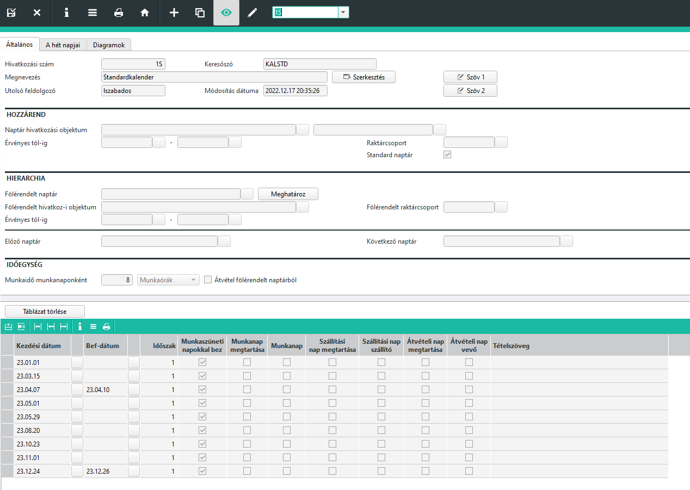
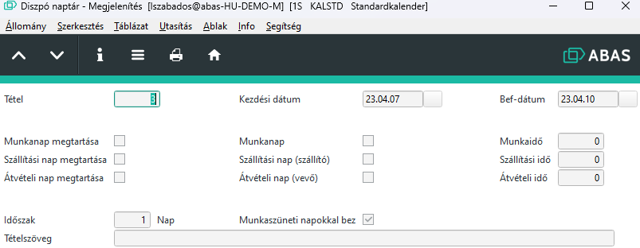
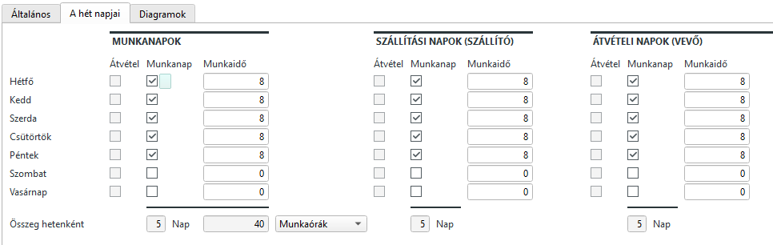
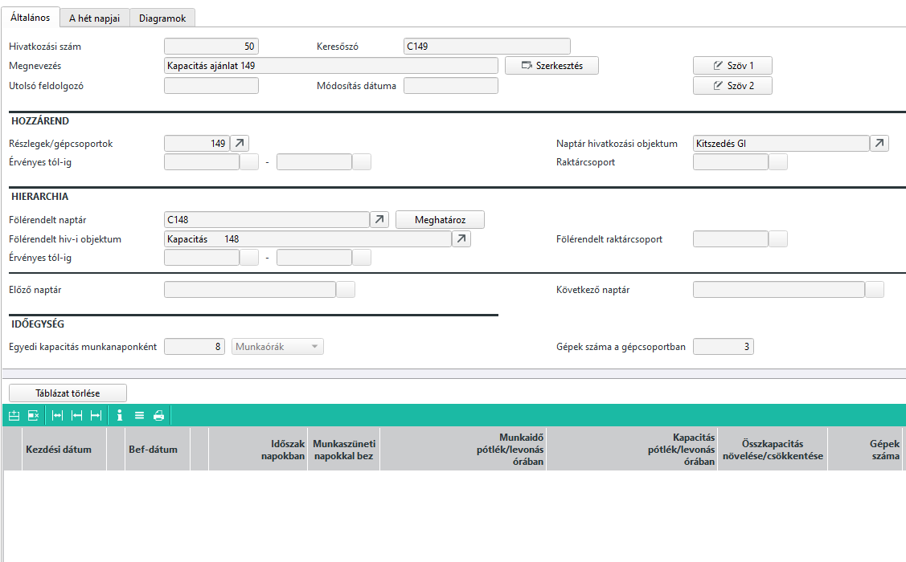
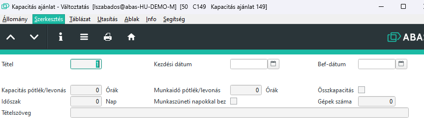

# Naptár

A naptár az abasban egy hiarerhikus rendszert követ.

Alapértelmezetten létezik egy standard naptár.

Ez alá lehet naptárakat betenni, ahol ez a standard az alapértelmezés, és lehet ehhez képest különbségeket definiálni.

## Dispo naptár

A legfelsőbb szintű Dispo naptár registere így nézhet ki

Itt sok minden nincs megadva, nem is kell. Itt célszerű az egész cégre vonatkozó általános naptárat definiálni. pl. munkaidő 8 óra munkanaponként

Atáblázati részben adahatunk meg időszakot vagy egyetlen napot.
Az időszak mező jelentése: ennyi naponként. Vagyis ha itt 14 áll, akkor az induló dátumtól kezdve minden második hetének azonos napja, amikor érvényes a beállítás.

A munkaszüneti napokkal bezárólag beállítás azt jelenti, hogy a beállítás az időszakban esetlegesen előforduló munkaszüneti napokon is érvényes. 

A munkanap megtartása, szállítási nap megtartása, átvételi nap megtartása bejelölésével a munkanap, szállítási nap és átvevő nap a felsőbb szint beállításait veszi át. Ha nincs bejelölve, akkor aktív a mellettük lévő munkanap szállítási nap és átvételi nap, és ezeket vagy be kell jelölni vagy sem.

Sornagyítóval látható a Munkaidő, szállítási idő és átvételi idő, ha a normál munkaidőtől eltérő óraszámot akarunk beírni.

### Hét napjai

Munkanapok,szállítási napok és átvételi napok heti munkarendjét állíthatjuk be, vagy átvétel a felsőbb szintről. Az óraszámokat is meg kell adni.

## Kapacitás ajánlat naptár

Egy kapacitás (részleg, gépcsoport) létrejön egy egyedi kapacitás naptár is, aminek a szülő naptára a dispo naptár.

A szülő naptár alapbeállításai érvényesek, de megjelenik a gépek száma, amit pedig a gépcsoporttól vett át.

A táblázati rész sornagyítóval viszont eltér

Hasonlóan a tételsor kezdő és záró nap megadható és azismétlődési időszak. A többi érték viszont a gépcsoportra vonatkozik, vagyis a megadott időszakban így változik a gépcsoport beállítása.

> Megadhatjuk, hogy a jövő héten az alapból 3 gépcsoport csak 2 lesz, ha a táblázatos részbe felvesszük a jövő hetet intervallumnak, 1 érték az időszakhoz és 2 érték a gépek számához.

