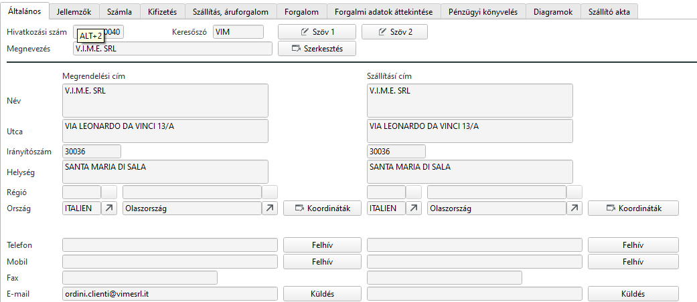
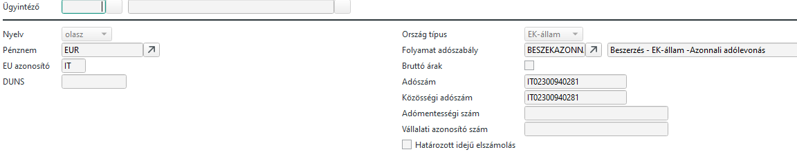
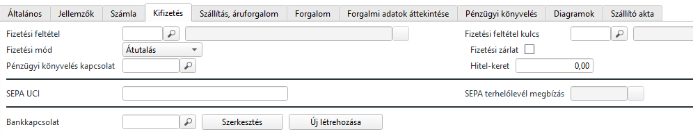

# Szállítók

A MASK-on a keresőszó nagyon fontos, mindenhol ezt kéri a rendszer. Érdemes a szállító nevéből könnyen megjegyezhetőt megadni max 8 karakter hosszan.

A megnevezést szokásos módon több nyelven is megadhatjuk.

Számla és szállítási címet külön megadhatunk 

A Számla fülön a pénznem és ha EU-s vállalat az EU-s országkódot be kell írni az EU azonosítóhoz.
Nyelvnél válasszuk azt a nyelvet, amelyikkel a bizonylatokat nyomtatni szeretnénk.

Folyamat adószabálynak válasszuk a megfelelőt
- Beszerzés - EK-állam -Azonnali adólevonás
- Beszerzés - Belföld - Adóköteles
- Beszerzés - Külföld - Adómentes

Adószámot kötelező megadniEU-s adószámot szintén,amennyiben EU-s partner.

> Ha nincs EU-s adószáma, akkor nem szabad adómentes számlát kiállítani!!!

Árcsoport automatikusan töltődik, de korrigáljuk ha kell.

Kifizetés fülön válasszuk a megfelelő Fizetési feltételt vagy Fizetési feltétel kulcsot, de nem kötelező.

Fizetési módnál Átutalás

