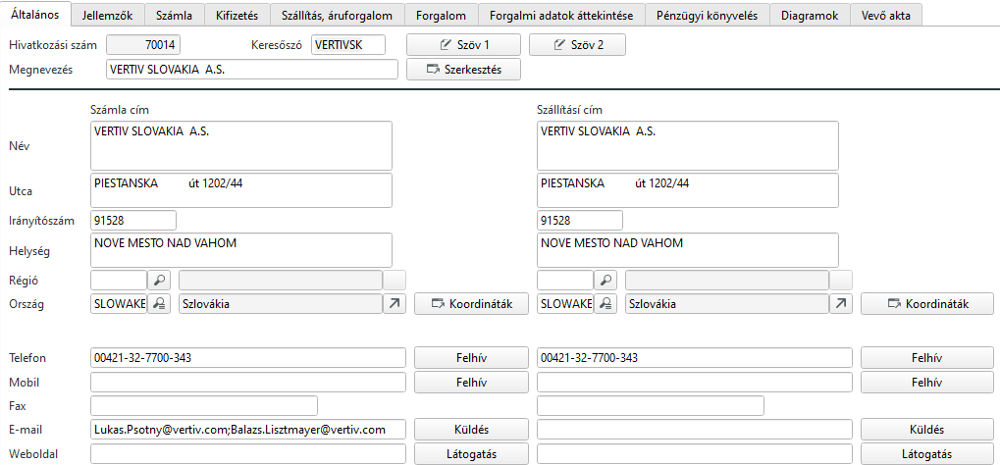
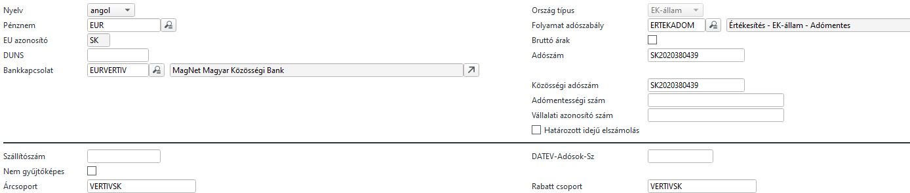
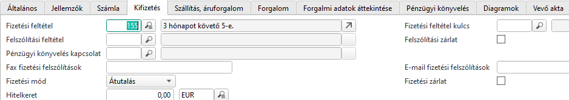
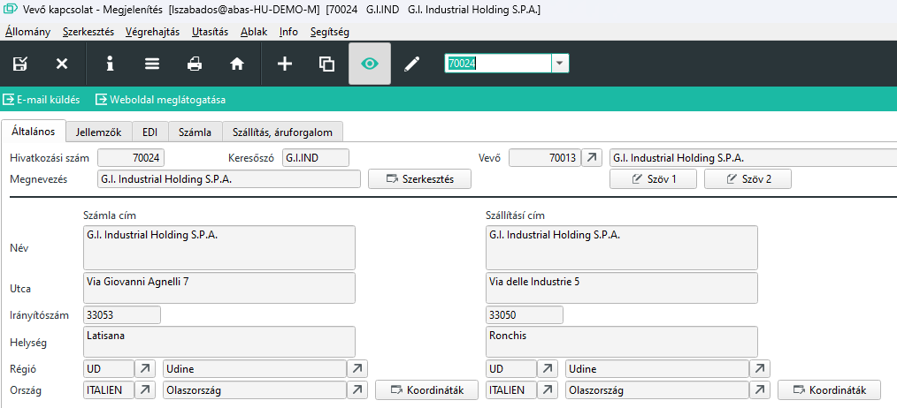

# Vevők

## Vevő kitöldendő mezői

A Vevők MASK-on a keresőszó nagyon fontos, mindenhol ezt kéri a rendszer. Érdemes a vevő nevéből könnyen megjegyezhetőt megadni max 8 karakter hosszan.

A megnevezést szokásos módon több nyelven is megadhatjuk.

Számla és szállítási címet külön megadhatunk 

A Számla fülön a pénznem és ha EU-s vállalat az EU-s országkódot be kell írni az EU azonosítóhoz.
Nyelvnél válasszuk azt a nyelvet, amelyikkel a bizonylatokat nyomtatni szeretnénk.

Bankkapcsolatnál azt a bankot válasszuk, amelyikkel el akarunk számolni a vevővel.

Folyamat adószabálynak válasszuk a megfelelőt
- Értékesítés - EK-állam - Adómentes
- Értékesítés - Belföld - Adóreleváns
- Értékesítés - Külföld - Adómentes

Adószámot kötelező megadniEU-s adószámot szintén,amennyiben EU-s partner.

> Ha nincs EU-s adószáma, akkor nem szabad adómentes számlát kiállítani!!!

Árcsoport automatikusan töltődik, de korrigáljuk ha kell.

Kifizetés fülön válasszuk a megfelelő Fizetési feltételt vagy Fizetési feltétel kulcsot

Fizetési módnál Átutalás

## Vevő kapcsolat

Vevő kapcsolategy vevőhöz rendelt további cím.

Fontos, hogy saját adószáma és EU azonosítója van, tölteni kell!

Ez akkor fontos, ha a vevő és számlafizető pl. EU-s vevő, de a szállítási cím egy magyar telephely. Ebben az esetben a számla belföldi számlának minősül és áfa tartalma lesz.

Egy vevőnek korlátlan ilyen "Telephelye" lehet.
