# Árak az ABASban

Az ABAS rendszerben az árucikk árát többféleképpen is megadhatjuk.

## Direk tár

Az Árucikk maskon az általános fülön van az Értékesítési ár és az alkalmazott mennyiségi egység.
Ez egy direkt ár, rendszerint nem használjuk, ezért értéke 0.

> az értékesítés fülün 9 féle további árat megadhatunk, ahol a valuta illetve a mennyiségi egység különbözhet.

## Beszerzési direkt ár

A beszerzésnél is van direkt ár, a beszerzés fülön az árucikk maskon belül. Minden szállítóhoz tudunk árat devizanemet, mennyiségi egységet és érvényességi határidőt beállítani.

## Árak rabbatok adatbázis

Az Árak rabbatok egy külön adatbázis, ahol nem egy árat rendelek egy adott termékhez.

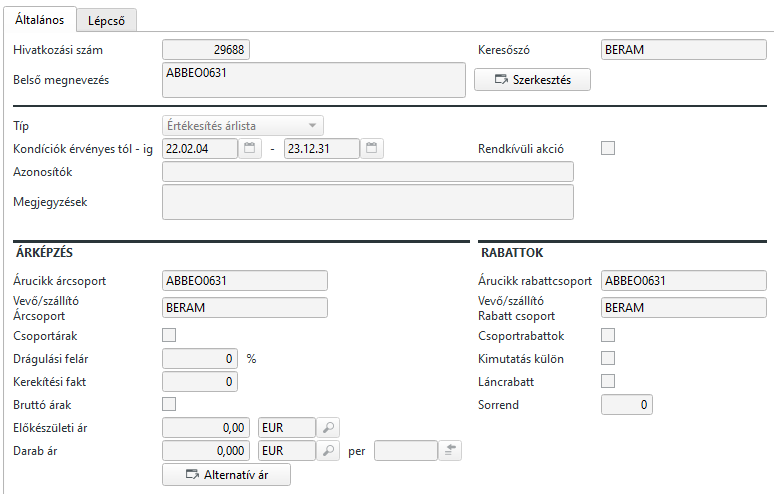

Először is meg kell érteni, hogy az adatbázisból hogyan választ az ABAS.

Az árucikkre és a szállítóra/vevőre nincs direkt hivatkozás, vagyis nincs utalómezővel összekötve. 

> Ez elsőre nem tűnik jónak, de később láthatjuk, hogy ez mekkora rugalmasságot ad

Mi alapján dönti el az ABAS, hogy melyik árat választja az adatbázisból?
- Típus, ami meghatározza hogy értékesítési vagy beszerzési ár
- Kondíció, ami az adott árak dátum szerinti érvényességét határozza meg.
- Árucikk árcsoport
- Vevő/szállító árcsoport

### Árucikk árcsoport

Az árucikk árcsoport egy árucikkre utaló szöveges kifejezés. 
Az árucikk maskon több helyen is szerepel: van egy értékesítési árcsoport és 5 beszerzési árcsoport mezőnk. Alapesetben ezek egyformák, de megadhatunk különböző értékeket is.
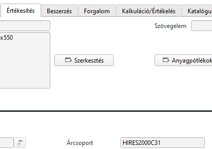
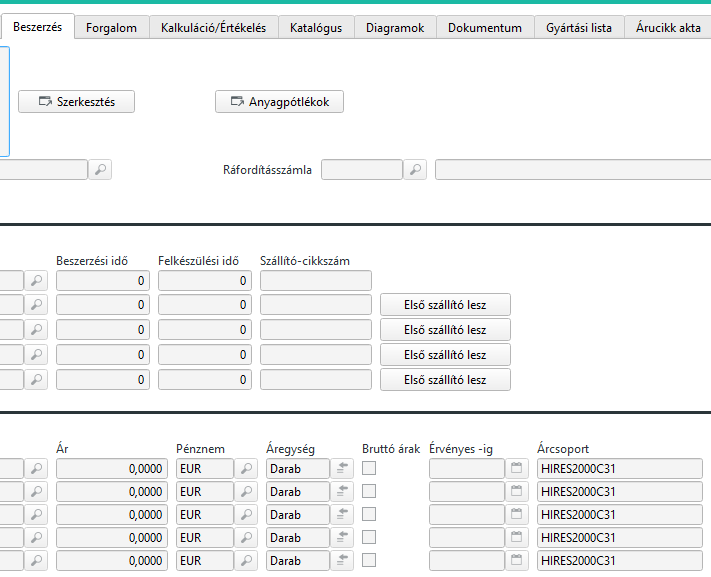

Az árak keresésekor azt az árat fogja kiválasztani, ahol az ÁrakRabbatok maskon az árcsoport mező üres, vagy ugyan ez van beírva.

### Vevő/szállító árcsoport

Az árak rabbatok maskon, ha a típus beszerzési ár, akkor szállító, ha értékesítési ár akkor a vevő adatbázisban keres.
Értékesítési ügyleteknél a bizonylat, pl megbízás tartalmazza a vevő adatait. Ugyan így egy megrendelésnél a szállítót választjuk ki elsőnek.

Az ABAS ennek függvényében tudja a típust (értékesítés vagy beszerzés) és tudja a Vevó/Szállító kódját.

A vevő és szállító askon a Számla fülön van Árcsoport mező.
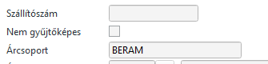

Itt is rendszerint a vevő keresőszavát adjuk meg, de nem kötelező, bármi megadható.

Azok az árak felelnek meg egy vevőnek/szállítónak, ahol az ÁrakRabbatoknál a Vevő/Szállító Árcsoport mező üres vagy az van beírva mint a Vevő/Szállító maskon.

## Kiválasztás

Az alábbi ábra szemlélteti az összefügéseket.

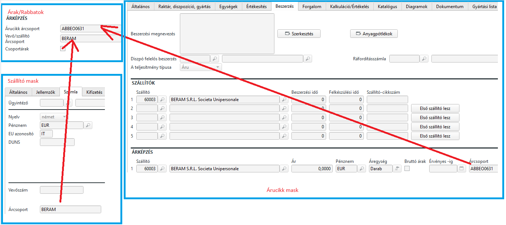

> Fontos, hogy ha az árak rabbatok táblában valamelyik érték nincs kitöltve, akkor az mindre vonatkozik. Ha nem töltöm ki az idő intervallumot, a vevő és az árucikk csoportot sem, akkor az adott ár minden vevő minden termékre igaz mindenkor. Szóval ha lehet ilyet ne mentsünk el!

## Árak meghatározása

Az árakat egy Ár lépcsővel lehet megadni.

Be lehet állítani a kereskedési egységet és áregységet, amennyiben az ár nem az alapértelmezett mennyiségi egységre vonatkozik.

> Lehet hogy darab az árucikkünk mennyiségi egysége. Kereskedelmi egységre viszont beírunk 1000 darabot, mert 1000 darabjával kell venni. Viszont az árat meg 100 darabra határozták meg. Vagyis 1 kereskedelmi egység az 1000 db lesz a raktárban és az ár a megadott ár 10 szerese lesz majd.

Meg kell adni az ár pénznemét.

Ezután a táblázatos rész következik. A táblázatban egy mennyiséget tudok megadni és ahhoz a mennyiséghez tartozó árat. A mennyiségeknek sorban növekvőnek kell lenniük, máshogy nem fogadja el az ABAS.

### Az árlépcső használata

> mennyiségi egységnek darabot írok, de ettől vonatkoztassunk el, minden árucikknél a beállított mennyiségi egység a mennyiségnél adott érték!

Alapértelmezésben a lépcsőt úgy kell érteni, hogy ha megadok 1-et akkor ezzel megadtam 1-nek az árát. Alatta 2,3,4 stb.

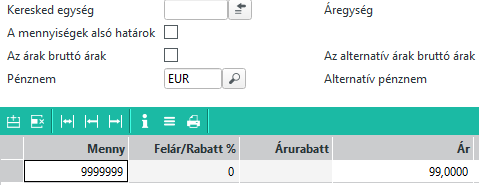

Legegyszerűbb eset. maximum 9999999 db-ot vehetünk, 99EUR egységáron

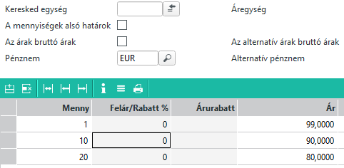

A fenti példában 1 darab esetén 99, 2-10 esetében 90, 11-20db esetén 80 EUR az ár. 20-nál nagyobb tételnek nincs ára!
Itt már van mennyiségi kedvezmény!

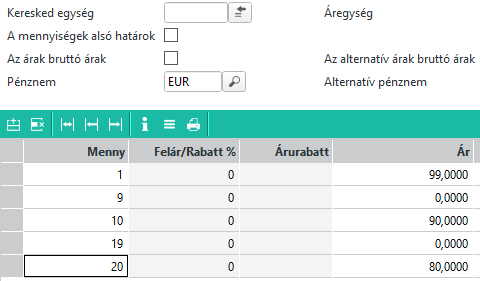

Ez egy trükkösebb példa! 1 db esetén az ár 99 EUR
Ezt követően 2-9 db-ig nincs ár!
10 db rendelése esetén 90 EUR
11-19 ig megint nincs ár
20 db esetén 80 EUR
20-nál többet nem vehetünk.

Ezt akkor kell alkalmazni, ha pontosan meghatározott mennyiségeket rendelhetünk.

### Mennyiségi egységek alsó határok jelölő

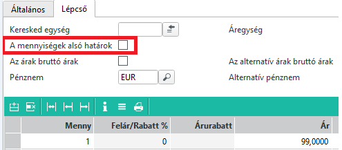

Ha ezt beállítjuk, akkor a táblázat értelmezése is megváltozik. Nézzük a példákat. Eddig a beírt mennyiségek a max mennyiségek voltak, most viszont a minimum mennyiséget adjuk meg!

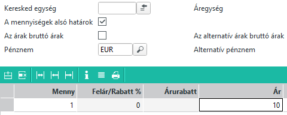

Szintén a legegyszerűbb példa. 1 vagy annál több mennyiségre 10 EUR

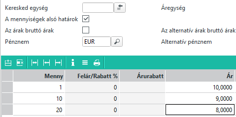

Itt már van lépcső, 
1-9 darab 10 EUR
10-19 db 9
20 db és felette!!! 8 EUR

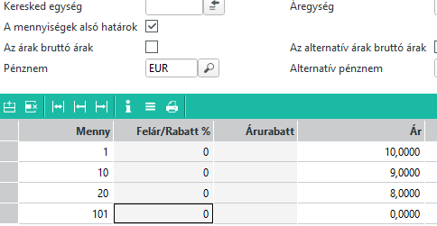

Ez a fenti példa kiegészítése, ahol max 100 db-ban korlátoztuk a mennyiséget, mert 101-től nincs ár.

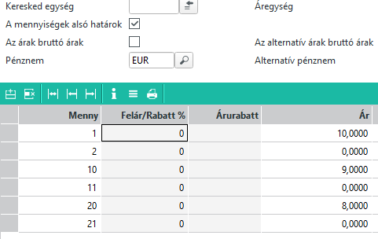

És végül az utolsó, amikor konkrét mennyiségeket lehet csak rendelni. Vegyük észre, hogy itt a 0 érték az alsó határtól indul és az utolsó sorral a maximális mennyiséget korlátoztuk.
> Ha a 21-es mennyiségű sort lehagyjuk, akkor 20 és feltte bármekkora mennyiséget rendelhetünk.

> Fontos, hogy az ár minden esetben egységárat jelent, nem az adott mennyiségnek az árát!

## Árak rabbatok karbantartás Infosystem

Ha szeretnénk meglévő árakat módosítani, akkor ez az infosystem a segítségünk.
Fontos megjegyezni, hogy az Infosystem csak az adott pillanatban érvényes árakat módosítja. Vagyis csak a jelenleg is érvényben lévő árakat. Ha vettünk fel még vagy már nem érvényes árat, azt itt nem fogjuk módosítani. Erre amúgy rendszerint nincs is sükség.

### Működése

Először is mivel rengeteg adat van, szűkítsük, mit is akarunk csinálni.
Pl. a BERAM megadta a "VIT" alapanyagok új árait. Rengeteg árucikk tartozik ide, mind VIT szóval kezdődik.

Ennek megfelelően a szűrést így állítsuk be:
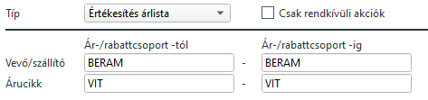

> vegyük észre, hogy az Árucikk mezőbe Árucikk árcsoportnál megadott szöveget vár, de részlettel is dolgozik. A fenti példánál az összes árat megmutatja, ami a mai napon érvényes, BERAM vevő és az Árcsoport "VIT" szóval kezdődik.

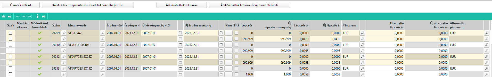

Én most ezt kaptam futtatásra. 
Látjuk, hogy az első tétel 2007.01.01 -től érvényes és 2023.12.31 ig.

Az elsőoszlopban kijelölöm a módosítani kívánt tételt. A hozzá tartozó lépcsős árakat is kijelöli automatikusan.
Több tételet vagy akár az összeset is kijelölhetjük.

Ha azt kaptuk, hogy az árak nem változtak, csak a 2023.12.31 2024.12.31 lett, akkor az "Új érvényesség -ig" mezőben átírom a dátumokat és az "Árak/Rabbatok felülírása" gombbal elmentem a változtatást. 

Ha azt mondják, hogy 2023.10.01 től változott az ár 0,0410 ről 0,051-re, és ez az ár 2024.12.31-ig érvényes, akkor viszont ezek a lépések:
Új érvényesség től: 2023.10.01
Új érvényeség -ig : 2024.12.31
Új lápcsős ár: 0,051

Menteni az "Árak/rabbatok lezárása és újonnan felvitele" gombbal!!!

Természetesen a fenti műveleteket az árak/rabbatok maskon is el lehet végezni, de itt gyorsabb és egyszerűbb.

