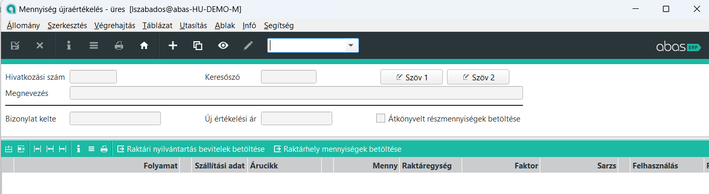
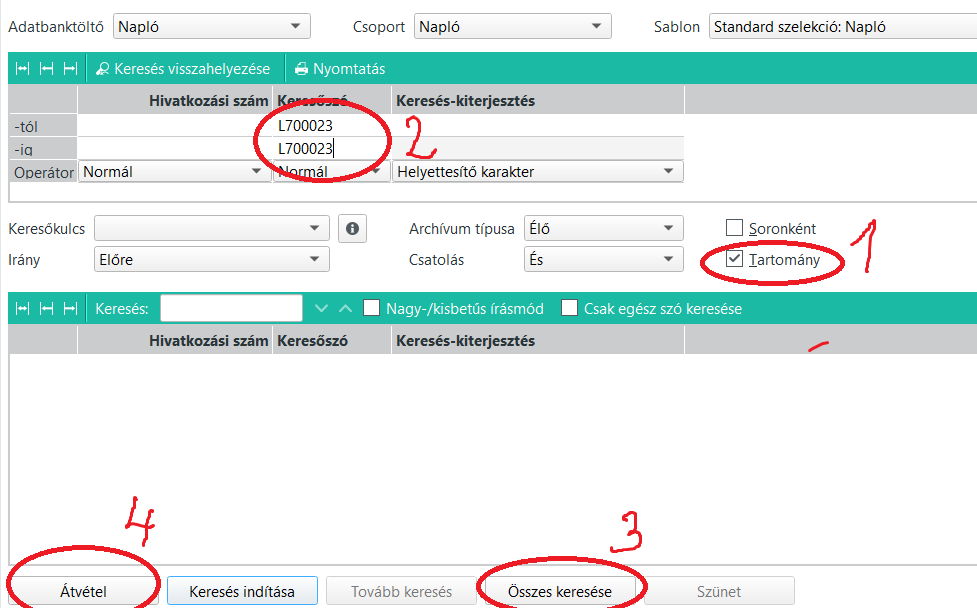
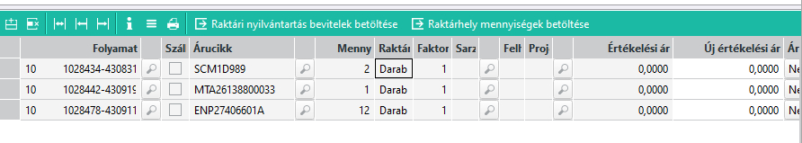

# Mennyiségi újraértékelés

A funkcióval tudjuk a számla nélkül, ebből kifolyólag ár nélkül érkező tételekhez árat rendelni.
E funkció nélkül az utókalkuláció nem jó értéket fog adni, és a leltár érték is hibás lesz.

## Indítása

Az Értékelések / Mennyiségi újraértékelés menüponttal indítható

A + jellel új felvitelt kérünk

Keresőszónak írjunk be valamit. Célszerűen pl egy L betűt, majd a szállítólevél hivatkozási számát.

> Itt ne a kapott szállítólevél számát adjuk meg, hanem amilyen számot a mi rendszerünk adott neki!!

A legelső, most még üres táblázati sorra állunk és rákattintunk a sorok fölötti "Raktári nyilvántartás bevitelek betöltése" menüpontra.

Az alábbi kereső nyílik meg.

1. Pipáljuk be a Tartomány lehetőséget
2. Adjuk meg a szállítólevél hivatkozási számát "L" előtaggal a tól-ig szűrőbe
3. Összes keresése gombbal keressük meg
4. Átadással másoljuk át az összes találatot

E lépések után a szállítólevél sorai áttöltődnek. A soroknál egyesével meg lehet adni az "Új értékelisi ár" oszlopban a tételek egységárát.

A változtatásokat mentsük el.

