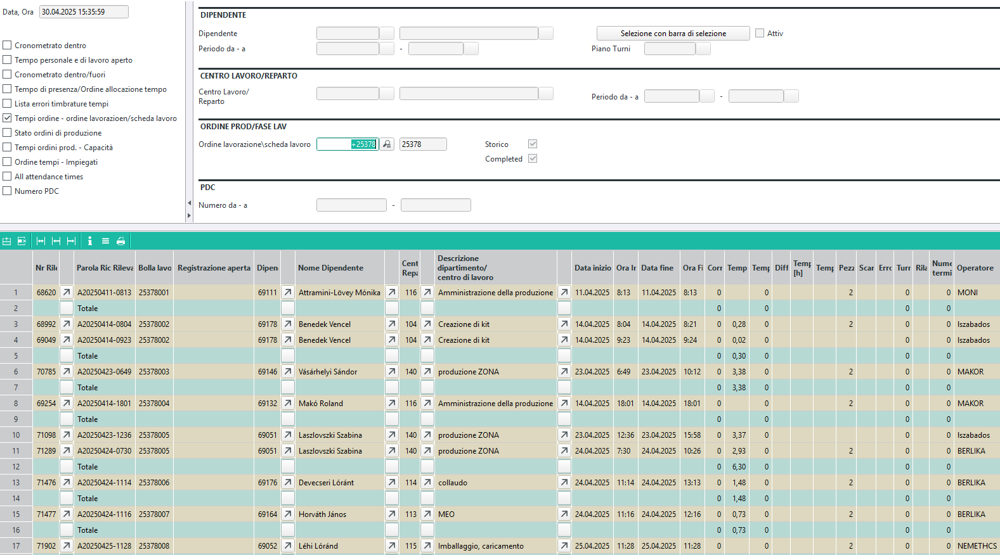

# Valutazioni BDE per produzioni chiuse

Gli ordini possono essere completati parzialmente o totalmente. In molti casi, il completamento degli ordini avviene in un intervallo di tempo più lungo o può contenere molte righe. In questi casi, è più pratico effettuare la valutazione per articolo.

Quando la produzione è chiusa, le righe scompaiono dal centro di produzione e non sono più accessibili.

Questa guida mostra come estrarre il numero degli ordini operativi da ABAS per le produzioni chiuse.

## Ricerca dell'ordine

Aprire il sistema informativo delle transazioni di vendita.

Durante il filtraggio, impostare il tipo di archivio su "Entrambi" per visualizzare anche gli ordini archiviati.
Con ulteriori filtri, restringere l'elenco dei risultati: cliente, numero del documento e intervallo di date.

Se si conosce il numero dell'ordine del cliente, è possibile cercarlo:

## Ricerca dell'ordine per codice articolo

Se non si conosce l'ordine ma il codice articolo, aprire il sistema informativo "Occorrenze articoli nei processi":

Impostare il tipo di archivio su "Entrambi".
Impostare il tipo di transazione su "Ordine".
Inserire il prodotto finito nel campo articolo.

Filtrare il periodo con la data del processo.

Come risultato, si ottiene l'elenco degli ordini che soddisfano i criteri. Se ci sono più ordini nel periodo, si ottengono più righe.

Selezionare l'ordine corretto nella colonna Processo.

## Estrazione dei dati di filtro dall'ordine

### Utilizzo

L'utilizzo è composto dal numero dell'ordine + "_" + numero di riga.

Se si desidera filtrare per l'intero ordine, è necessario solo la parte prima del simbolo "_", che corrisponde al numero dell'ordine.

Se si desidera valutare una specifica riga dell'ordine, è necessario l'intero numero di utilizzo.

> Se lo stesso articolo appare più volte nell'ordine, l'utilizzo distingue le righe specifiche!

### Date per il filtro

La ricerca è molto più veloce se si utilizza un intervallo di date, quindi è necessario delimitare il periodo di produzione.

La produzione avviene sicuramente dopo l'ordine, quindi la data del processo dell'ordine è il punto di partenza.

La produzione è sicuramente chiusa prima della spedizione, quindi la data di consegna è la data finale.

> Qui si vede la data di consegna prevista. In caso di consegna ritardata, è possibile specificare una data successiva o filtrare l'ordine nel sistema informativo delle transazioni di vendita, dove sono visibili le bolle di consegna emesse e le relative date.

## Filtraggio del registro di magazzino

Aprire il sistema informativo della gestione del magazzino.

Selezionare l'opzione tramite modello di selezione.

Selezionare il modello BDE.

Inserire l'intervallo di date determinato sopra nel campo della data del documento.

Nel campo Utilizzo, inserire il numero di utilizzo (o solo il numero dell'ordine) sia nel campo "da" che nel campo "a".

Come risultato, si ottengono i documenti di conferma della produzione, dove il numero del documento inizia con il numero dell'ordine operativo. (Gli ultimi 3 numeri devono essere rimossi)

## Avvio della valutazione BDE

Aprire il sistema informativo delle valutazioni BDE.

Selezionare la modalità ordine operativo e inserire il numero dell'ordine operativo.

> Se l'ordine operativo è già archiviato, il sistema aggiunge automaticamente un segno "+" davanti.

Eseguire il sistema informativo per ottenere i rapporti.

## Calcolo a posteriori

Se si desidera confrontare il calcolo preliminare e quello a posteriori del pannello, aprire il sistema informativo:

Inserire il numero dell'ordine operativo ed eseguire il sistema informativo.

Viene visualizzato il confronto tra il calcolo preliminare e quello a posteriori.

## Relazione tra BDE e calcolo a posteriori

Poiché i gruppi di macchine nel caso di E.R.C. Kft non sono macchine, non hanno costi.
Pertanto, i costi fissi e variabili sono pari a 0.

Tuttavia, ci sono costi di manodopera, che vengono calcolati in base al tempo dell'operazione e alla tabella salariale.

Nel calcolo preliminare, i costi di manodopera pianificati vengono calcolati in base al tempo operativo pianificato.

Nel calcolo a posteriori, i costi vengono calcolati in base ai tempi riportati e ai costi salariali dei lavoratori.

Ad esempio, nel caso precedente, l'operazione di test è risultata come segue:

Nelle ultime colonne, il sistema ha calcolato un costo di 41,6 EUR con un tempo standard di 2,08 ore.

In base ai rapporti, il costo è stato di 11,1 EUR, poiché il tempo riportato è stato di 0,74 ore.

Nel BDE:

Per 2 pannelli, il lavoratore ha riportato un totale di 1,48 ore, da cui è stato calcolato il dato sopra.

Nel BDE, per un'operazione possono esserci più rapporti di diversi lavoratori, la somma dei quali dà il risultato.

Ad esempio, il prelievo:

Invece di 0,5 ore di tempo pianificato, sono state riportate 0,3 ore, ma in 2 parti.

