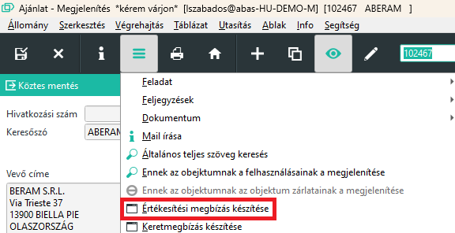
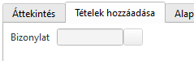
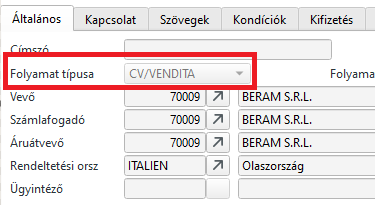

# Megbízás

Ha még nem tettük meg, olvassuk el az [Ajánlat](ajanlat.md) leírást, mert a legtöbb mező kitöltése azonos, és itt nemrészletezzük ismét.

## Megbízás ajánlat nélkül

A [Ajánlat](ajanlat.md) leíráshoz hasonlóan lehet új megbízást rögzíteni.

## Megbízás ajánlatból

Több lehetőség is van

1. Ajánlatokból/keretmegbízásokból/web megrendelésekből menüpontal. Az ajánlat sorszámát fogja érni és abból létrehozza a megbízást.
2. Értékesítési ügyletek Infosystemmel, az ajánlat sorában az Átadás gombra kattintva.
3. Az ajánlat maskon a hamburger menüből az értékesítési ajánlat készítése menüpontot kiválasztva.

### Nem minden ajánlati sor átvétele

Vannak esetek, amikor nem minden ajánlati sort akarjauk átvenni, mert nem kértek mindent, vagy csak részben van elfogadva.

Ilyen esetben készítsünk megbízást az ajánlatból és egyszerűen töröljük ki a nem kívánatos sorokat.

### További ajánlati sorok átvétele meglévő megbízásra

Lehet egy megbízásra több ajánlat sorait is átvenni, vagy ha első körben nem minden ajánlati sort vettünk át, akkor a még hiányzó sorok átvehetőek.

Átvételhez nyissuk meg a létező megbízást és a Tételek hozzáadása fülön írjuk be az ajánlat sorszámát.

> ha így olyan sorokat is átvettünk, amit nem szeretnénk, akkor egyszerűen töröljük a megbízásról.

> Bár lehetséges és az ABAS rendszernek nem okoz problémát, több ajánlatot mégsem érdemes egy megbízásra összevonni, mivel a Pozíció értéke így lehet azonos. A nyomatokban nem okoz félreértést, mert a vevő megrendelésszámára is hivatkozik, ennek ellenére okozhat zavart.

## Megbízás további mezői

Azoka amezők, amik az ajánlatban léteztek és ki voltak töltve, az ajánlatból átvételre kerültek. Vannak azonban további mezők, amiket ki kell/lehet töltenünk.

### Folyamat típusa

Amennyiben a vállalat definiált folyamat azonosítót a csoportosításokhoz, akkor itt válasszuk a megfelelőt.

### Pozícióérték (Tételérték) fixálása

A mező automatikusan kijelölésre kerül:

az ár, a rabatt vagy egy tétel adójának kézi módosításánál
egy tétel átvételénél egy következő ügyletbe, pl. ajánlat - megbízás - szállítólevél - számla.
Ha a táblázati tétel értéket fixálja és az alárendelt ügyletekbe át akarja venni, akkor jelölje ki ezt a mezőt kézzel! Ez a semleges tételekre is érvényes, mint kiegészítő tételekre.

A megrendelési, átraktározási és külső gyártási javaslatok átadásánál a tételérték nem kerül fixálásra, hanem annak fixálása a javaslatból kerül átvételre. Automatikusan végrehajtásra kerül egy árképzés az összes nem fixált tételre vonatkozóan. A fixált tételekhez ez elmarad, az Árak és rabattok átszámítása nyomógombra való kattintás és a mennyiség módosítása esetén is. Mihelyt a mező kiürítésre kerül, azonnal végrehajtásra kerül ár-, ill. rabattképzés az illető tételhez.

A tételérték pl. az Összár mező kijelölése után kerül megjelenítésre. Az Összár mezőben való 0 vagy üres bevitellel, vagy az adóalap módosításával a mező kiürül és a fixálás megszűnik.

A nem fixált adóösszegek a kalkulációnál, ill. a maszk elhagyásánál újra kiszámításra kerülnek. Ha a kiszámolt adóösszegtől eltérő tételérték kerül beírásra, akkor a létrehozott pénzügyi könyvelésben elhelyezésre kerül az Adóeltérés utalás, és a számlakivonatban erre utalás történik.

### Fix, Szállítási határidő fixálása

Ennek a mezőnek a kijelölésével szabályozza, hogy hogyan határozható meg a szállítási határidő a diszpozíción keresztül. A mező kijelölésével a szállítási határidő fixálásra kerül és a diszpófuttatásban már nem módosul. Ha a mező üres, akkor a szállítási határidő a diszpozíción keresztül kerül kiszámításra. A mezőben a lehető legkorábbi határidő kerül beírásra.

Vevői megrendelés tételek rögzítésekor vagy módosításakor a mező automatikusan kijelölésre kerül:

ha a Nyomtatás kijelölésre kerül
ha a Betervezés ki van jelölve és a szállítási határidő módosításra kerül
A fixálás kézzel módosítható, ameddig a Státus üres.

> Ha a szállítási határidők a beszerzési és értékesítési ügyletek táblázatában nincsenek fixálva, akkor a határidők a szállító, ill. a vevő módosítása esetén - az érvényes diszpó naptárnak megfelelően - újonnan meghatározásra kerülnek. Ez akkor is érvényes, ha maga az ügylet fixálva van.

### Felhasználás

Ez a mező automatikusan töltődik. Értéke a megbízás sorszáma + "_" jel + sorszám. A sorszám alapesetben a megbízás táblázati sorának száma, de ha módosítjuk a megbízást , pl töröljük az első sort és beszúrunk egy másikat, akkor is a következő sorszámot kapja és a törölt sor sorszáma nem kerül újból kiadásra.

Ez az azonosító nagyon fontos, mert a vevői megrendelésre gyártott termékeket ez azonosítja a raktárban és a gyártás folyamán is végig minden tételnél ott van.

### Status

Amíg üres kézzel is tölthető, vagy a rendszer tölti.
Ha üres, akkor a sor még nem teljesült.
Ha ki van töltve, akkor a sor teljesült vagy stornózták.

Amennyiben a soron 6 darabot kértek egy termékből amiből 3-at leszállítottunk és ezután a státuszba beírunk valamit, pl "S" betűt, akkor a maradék mennyiség stornózódik.
Ugyan ilyen esetben, ha a 6-ból 3-at leszállítottunk, és a mennyiséget 6-ról 3-ra csökkentjük (kevesebbre nem lehet, mert 3 már teljesült!), akkor az ABAS észleli, hogy így a sor teljesült hiszen a 3-ból 3 kiszállítva, ezért a Status mezőbe egy "*" jelet tesz és késznek tekinti a sor.

Ha a Status mező nem üres, akkor már mennyiséget szállítási határidőt, Folyamat fixálása mezőt, Betervezés mezőt, stb nem lehet módosítani, mert étrelmét vesztették.

### Betervezés

Ha be akarja tervezni egy megbízás tételét, akkor jelölje ki ezt a mezőt!

Ekkor a tételt a diszpó betervezi és beszerzési javaslatok és kapacitásfoglalások készülnek.
A funkció csak árucikkeket foglal magában, kiegészítő tételeket nem.
Egy vevői megrendelés (megbízás) tételben a Betervezés csak akkor jelölhető ki, ha beírásra kerül jóváhagyott szállítási határidő. Ameddig a szállítási határidő hiányzik, addig a betervezés írásvédett.
A betervezés beállítása a megbízásból a megbízási gyártási listába való lemenetnél továbbadásra kerül és ott módosítható.
A mező beállítás elmenthető alapértelmezett beállításként.
A betervezés információ átvételre kerül infosystemekbe.
Ha egy [Szerviz megrendelés] egy [Szerviz ajánlat]-ból készül, akkor a Betervezés kijelölése az alapértelmezett beállítás.