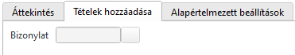

# Értékesítési szállítólevél

Értékesítési szállítólevél többféleképpen indítható

1. Megbízásból a hamburger menüből
2. Szállítólevwelek/Megbízásokból menüponttal
3. Értékesítési ügyletek infosystemből az átadás gommbbal a megbízáson állva

## Több megbízás egy szállítón

A vevőnek lehet párhuzamosan több megbízása és lehetséges, hogy a szállításkor több megbízást vagy több megbízás egyes részeit szállítjuk.

Ebben az esetben a folyamat a következő:

Az egyik megbízásból a fenti módszerek egyikével készítünk egy szállítólevelet.

Ha nem minden megbízási tételt szállítunk, akkor töröljük a feleslegeseket.
Ha a tételeket nem a megrendelt mennyiségben szállítjuk, csökkentsük a mennyiséget a tényleges értékre.

Ezt követően a táblázati rész felett a Tételek hozzáadása fülön adjuk meg a következő megbízás sorszámát

Elfogadás után egy szeparációs sorral beszúrásra kerül a megadott megbízás még nem teljesült sorai.
Itt ugyan az a folyamat, töröljük a nem szállítandó sorokat és/vgay javítsuk a mennyiségeket.

Ezt a folyamatot kell ismételni az összes megbízásra.

## További tételek beszúrása

Amennyiben további nem megbízáson szereplő tételeket szeretnénk felvinni, pl. raklap, akkor a szállítólevél alján csak egyszerűen szúrjunk be további sorokat.

> Amennyiben ezen tételek nem kerülnek számlázásra, fontos, hogy vegyük ki a számla releváns jelölést a táblázati sor sornagyítójában.

## Szállítólevél mentése

Mentés után a szállítólevél sorszámot kap, de ettől a készlet nem változik, az ABAS szempontjából az áru még itt van

A szállítólevél megnyitható szerkesztésre és módosítható.

A megbízások, amit a szállítólevél érint, még nem teljesültek.

## Szállítólevél könyvelése

A szállítólevelet szerkesztési módban megnyitva a táblázati sorok feletti Áttekintés fülön a Könyvelés jelölőt be kell kapcsolni és meneteni.

Ekkor a szállítólevél 
- könyvelésre kerül
- a raktárkészlet csökken a szállított menyiségekkel
- az érintett megbízásokon az elszállított mennyiségek fixálásra kerültek. Ha egy megbízás sor teljesen teljesül, a státusz beállításra kerül és továbbiakban nem módosítható.
