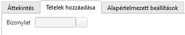

# Értékesítési számla

Értékesítési számla többféleképpen indítható

1. Megbízásból a hamburger menüből
2. Szállítólevélből a hamburger menüből
2. Számlák/Megbízásokból/szállítólevelekből menüponttal
3. Értékesítési ügyletek infosystemből az átadás gommbbal a szállítólevélen állva

Fontos észrevenni, hogy számlátlehet szállítólevél vagy megbízás alapján is kiállítani.

A számla helyettesítheti a szállítólevelet, de akkor a szállításkor késznek kell lennie.

Ezenkívül a számla tartalmazhat olyan tételeket is, amik nem igényelnek szállítást.

## Több megbízás vagy szállítólevél egy szállítón

Folyamat a következő:

Az egyik megbízásból vagy szállítólevélből a fenti módszerek egyikével készítünk egy számlát.

Ha nem minden tételt számlázunk, akkor töröljük a feleslegeseket.
Ha a tételeket nem az átvett mennyiségben számlázzuk, csökkentsük a mennyiséget a tényleges értékre.

Ezt követően a táblázati rész felett a Tételek hozzáadása fülön adjuk meg a következő szállítólevél/megbízás sorszámát

Elfogadás után egy szeparációs sorral beszúrásra kerül a megadott megbízás/szállítólevél még nem teljesült sorai.
Itt ugyan az a folyamat, töröljük a nem számlázandó sorokat és/vagy javítsuk a mennyiségeket.

Ezt a folyamatot kell ismételni az összes szállítólevélre/megbízásra.

## További tételek beszúrása

Amennyiben további tételeket szeretnénk felvinni, pl. munkadíj, akkor a számla alján csak egyszerűen szúrjunk be további sorokat.

## Számla mentése

Mentés után a Számla sorszámot kap

A számla megnyitható szerkesztésre és módosítható.

## Számla könyvelése

A számlákat szerkesztési módban megnyitva a táblázati sorok feletti Áttekintés fülön a Könyvelés jelölőt be kell kapcsolni és meneteni.

Ekkor a számla
- könyvelésre kerül
- a raktárkészlet csökken a szállított menyiségekkel, amennyiben megbízásból, nem kiszállított tételeket számláztunk
- az érintett megbízásokon az elszállított mennyiségek fixálásra kerültek. Ha egy megbízás sor teljesen teljesül, a státusz beállításra kerül és továbbiakban nem módosítható.

