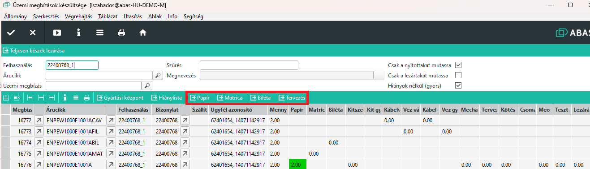

# Gyors visszajelentések

EGyes műveleteket nem lehet a várt módon visszajelenteni, mert nem határozható meg pontosan mikor kezdték el és mikor fejezték be a műveletet.

Ez adódhat abból, hogy pl egy nyomtatás elindítása után, amíg a gép dolgozik mást is lehet párhuzamosan csinálni, ami nem is az adott termékhez tartozik, másrészt lehet többször félbe kell szakítani a feladatot, más ügy miatt.

Ilyen művelet jelenleg 4 van meghatározva: Papírok nyomtatása, Bilétanyomtatás, Matricák nyomtatása és a Tervezés.

## Infosystem a feladat meghatározásához, és a visszajelentéshez

ABAS-ban a céges fülön az [ERC/Gyártás/Üzemi megbízások készültsége](megbizasok-keszultsege.md) Infosystemet kell elindítani.

Ha ezt csak simán futtatjuk minden szűrés nélkül, akkor látjuk az összes elindított és nem lezárt üzemi megbízást.

Az egyes oszlop nevére kattintva sormarendezhetjük a sorokat. Ez akkor célszerű, ha pl. a papír műveletekre vagyunk kiváncsiak, akkor a papír oszlopra kattintva sorbarendeződnek a sorok és egyben láthatjuk a papír visszajelentéseket.

Ahol nem zöld színű a mező, ott még nem volt visszajelentés.

Ha végeztünk a művelettel, akkor a soron állva a sorok fejlécében lévő gombokkal lehet a műveletet jóváhagyatni.

> Az ablak nem frissíti magát, vagyis a Play gombbal frissíteni kell, hogy a változást láthassuk. Kattintás után várjunk kb 5 másodpercet, utána frissítsünk.

> A funkció használatához jogosultság szükséges, vagyis nem indíthatja bárki.

