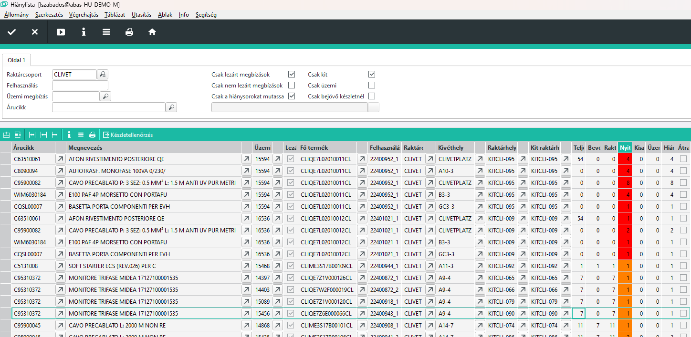

# Hiánylista

A hiánylista Infosystem az üzemi megbízások (vagyis az elindított gyártások) gyártási listáit nézi át.

A gyártási listán szereplő alapanyagból az igény az egy termék legyártásához szükséges mennyiség felszorozva a gyártandó mennyiséggel.
Ez az összeg az összes szükséges mennyiség.

Ebből le kell vonni azt a mennyiséget, amit már anyagfelhasználásként már esetleg visszajelentettünk, vagyis visszajelentettük, hogy beszereltük.

A maradék szám az a mennyiség, aminek a gyártáshoz rendelkezésre kell állnia.

Az üzemi gyártási listán szerepel, hogy az ABAS melyik raktárhelyről próbálja az alapanyagot levonni anyagfelhasználás visszajelentésekor.
Ha az alapanyagból ezen a raktárhelyen megvan a szükséges mennyiség, akkor ez nem hiány, hiszen ott van az alapanyag, csak nincs beszerelve.

Hiány az a mennyiség ami e felett van.

A hiány lehet abból, hogy van alapanyag raktáron, csak nincs átraktározva a megfelelő kivét raktárhelyre, vagy lehet valóban hiány, amikor nincs készleten az alapanyag.

## Hiánylista sora

A táblázati sorban az alábbi oszlopok szerepelnek:
- árucikk és megnevezés: az érintett árucikk keresőszava és neve
- Üzemi megbízás: üzemi megbízás száma
- lezárt megbízás: ha be van állítva, azt jelenti, hogy az üzemi megbízás készre van jelentve, a gyártás befejeződött, de a hiányzó alapanyagot nem szerelték be, ha nincs beállítva, akkor még gyártás alatt van a termék
- Fő termék: az a kész vagy félkész termék, aminek a gyártási listáján szerepel az alapanyag
- felhasználás: azonosítja a megbízás táblázati sorát
- Raktárcsoport: az a raktárcsoport, ahol a gyártás történik és ahol az alapanyagnak rendelkezésre kell állnia.
- Kivéthely: az a raktárhely ami az alapanyag kivét raktárhelye a raktárban, az adott raktárcsoporton belül
- Raktárhely: a gyártás során használt kivét raktárhely. Itt kell a felhasználáshoz rendelkezésre állnia az alapanyagnak
- Kit raktárhely: a fő termékhez beállított kit raktárhely, amennyiben létezik. Olyan alapanyagnál amit kitbe szedünk, a raktárhely és a kit raktárhely azonos, de üzemi raktáron tartott alpanyag esetén eltér
- Teljes mennyiség: raktárcsoporttól függetlenül az alapanyag teljes mennyisége raktáregységben
- Bevét raktárhelyen mennyiség: Az árucikk raktárcsoport szerinti bevét raktárhelyén elérhető mennyiség.
- Raktárkészlet: az árucikk raktárban és bevét raktárhelyen rendelkezésre álló mennyisége.
- Nyitott mennyiség: az a mennyiség, ami hiányzik és sem kiszedve, sem üzemi raktárhelyen nem áll rendelkezésre.
- Kiszedve: a kitben már rendelkezésre álló mennyiség
- Üzemben mennyiség: Üzemi raktárhelyen elérhető mennyiség
- Hiány: nem visszajelentett mennyiség mínusz a Kiszedve és Üzemben mennyiség összege.
- Átraktározással: ha be van állítva, akkor az adott alapanyagot nem a gyártás szerinti raktárcsoportból kell venni, hanem egy másik raktárcsoportból átraktározással. Ilyen esetben a raktárcsoport és kivét hely értékek eltérhetnek az üzemi megbízás raktárcsoport beáééításaitól

## Színjelölések

A nyitott mennyiség oszlopban
- fehér cella azt jelenti, nincs hiány
- a narancssárga cella azt jelenti, van rendelkezésre álló alapanyga, de nincs átraktározva/kiszedve
- a pirosszín esetén nincs a raktárcsoportnak megfelelő helyen elérhető alapanyag

> a fehér cella azt jelenti nincs hiány, de nem jeleni azt, hogy az anyagfelhasználás kész. Ha a kitben benne van az alapanyag, de még nincs beszerelve, az nem hiány!

> Piros szín esetén is lehet az alapanyagból raktárkészlet, de más raktárcsoporton.

## Szűrési feltételek

Lehet raktárcsoportra, felhasználásra, üzemi megbízásra és adott árucikkre is keresni.

> lehet több feltételt is megadni, de a rendszer nem figyelmeztet az összeférhetetlenségre. Pl ha megadunk üzemi megbízást és felhasználást is, de a felhasználás nem az üzemi megbízáshoz tartozik, üres lstát fogunk kapni.

### Csak lezárt megbízások, csak nem lezárt megbízások

A két kapcsoló vagy ki van kapcsolva vagy egyikük be.
A csak lezárt megbízások esetén a készlek jelentett üzemi megbízásokat látjuk.
A csak nem lezártak esetén, a gyártás alatt lévő megbízásokat látjuk.
Ha egyik sincs bejelölve, mindent látunk.

> A kit félkész terméket lehet már késznek jelöltük mielőtt gyártáshoz a raktár átadta, de lehet benne hiány. Ebben az esetben ez egy lezárt üzemi megbízás, de a készermék még gyártás alatt van. 

### Csak kit, csak üzemi

A két kapcsoló vagy ki van kapcsolva vagy egyikük be.

Az alapanyagoknál be van állítva, hogy kitbe szedjük vagy sem. Amit nem kitbe szedünk, annak az üzemi raktárhelyen kell rendelkezésre állnia gyártás közben.

Ezekkel a kapcsolókkal tudunk csak kitbe tartozó vagy csak üzemi raktárhelyhez tartozó alapanyagokra keresni.

### Csak hiánysorokat mutassa

A program mindenképpen az összes nem archivált üzemi gyártási listát átnézi. Alapértelmezetten a "Csak a hiánysorokat mutassa" kapcsoló be van állítva, így csak azokat a sorokat látjuk, ahol hiány van, vagyis vagy narancssárga vagy piros a nyitott mennyiség cellája.

Ha a kapcsolót nem jelöljük be, akkor a nem hiányos sorokat is hozza a táblázat

### Csak bejövő készletnél

Ennek a kapcsolónak a hatására, csak azokat a hiányzó árucikkek sorait hozza a rendszer, amiből van készlet a raktárcsoportnak megfelelő bevét raktárhelyen.
Ez fontos, hogy amikor beérkezik áru, azonnal lássuk, tudunk e abból hiányzó tételeket pótolni.

lásd: [Bejövő készlet pótláshoz](../raktarozas/bejovo-keszlet-potlashoz.md)

## Kászletellenőrzés

Ha kiványcsiak vagyunk egy adott sor készleteire, akkor a soron állva és a táblázati rész feletti gombsoron a készletellenőrzés gombra kattintva megnyílik a Készlet-info, az árucikkre leszűrve.
Ezzel pontosabb képet kaphatunk a készletről.