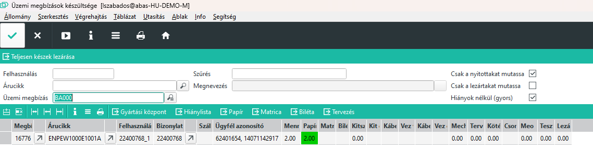

# Megbízások készültsége

Az infosystemmel a nem lezárt üzemi megbízásokat láthatjuk, egy megbízás egy sor.

Szűrni lehet egyetlen megbízásra, ekkor egy sort kapunk
Felhasználásra, ekkor egy megbízáshoz tartozó összes kész és félkésztermék nem archivált üzemi megbízását látjuk.

Árucikkre is szűrhetünk, de itt az üzemi megbízáson szereplő árucikk értendő, vagyis kész ill. félkésztermék adható meg.

## Csak nyitottakat mutassa

A mező bekapcsolásával a nem lezárt üzemi megbízásokat listázza csak a rendszer, vagyis amik gyártás alatt vannak.

## Csak a lezártakat mutassa

Ebben az esetben a lezárt, már gyártás alatt nem lévő üzemi megbízásokat listázzuk. Itt a törlésvédelemmel ellátott kész üzemi megbízásokat látjuk.

## Eredménysorok oszlopai

- Megbízás: üzemi megbízás kódja
- Árucikk:kész vagy félkésztermék, aminek a gyártását az üzemi megbízás kérte
- Felhasználás: a megbízás sorát azonosító kód
- Bizonylat: a megbízás (ha volt)
- Szállítási határidő: amennyiben a megbízásról vagy gyártási javaslatról leolvasható
- Ügyfél azonosító: a megbízás "Önök azonosítója" mező értéke. Vevő megrendelésszáma rendszerint
- Mennyiség: a legyártandó mennyiség
- Művelet nevek: Amelyik művelet név oszlopban nem üres a cella, az a művelet szerepel az üzemi megbízáson. Értéke 0 és a Mennyiség oszlop értéke közötti. Itt láthatjuk, hogy a visszaigazolások alapján a kész illetve félkész termékek gyártása melyik szakaszban van.

> Ha a művelet a szükséges mennyiségben visszaigazolásra került, a mező színe zöld lesz.
> Ha minden művelet kész akkor a Mennyiség oszlop cellája is zöld lesz, jelezve, hogy teljesen kész.

> A megbízás cella színe fehér, ha nincs hiány és kész a gyártás

> Világoskék színű, ha van hiány de még gyártás alatt vagyunk

> Piros színű, ha kész a gyártás, de van alapanyag hiány

## Gyártásközpont megynitása

Egy üzemi megbízás soron állva a táblázati sorok feletti gombsoron a "Gyártási központ" nyomógombbal tudjuk a gyártási központban elemezni a terméket.

> A gyártási központ mindenképpen a felhasználás értékre szűr!

## Hiánylista

A gombsorról a hiánylista is megnyitható, ahol az üzemi megbízáshoz tartozó alapanyagokra történi a szűrés.

## Gyors visszajelentések

Egy üzemi megbízáson a Papír, Matrica, Biléta és Tervezés műveletek egyetlen gombnyomással visszajelenthetőek.

> Itt a művelet megnyitása, lezárása és könyvelése is megtörténik és minden esetben a maximális mennyiséggel

> A funkció mindenki számára látható, de jogosultság függő, vagyis csak felhatalmazott dolgozó tud így visszajelenteni.