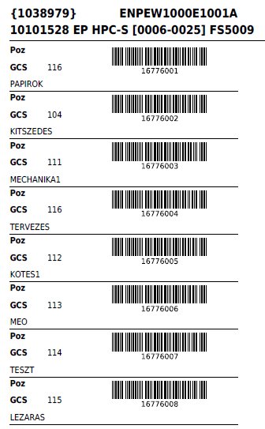
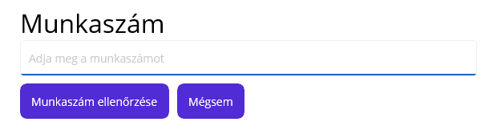
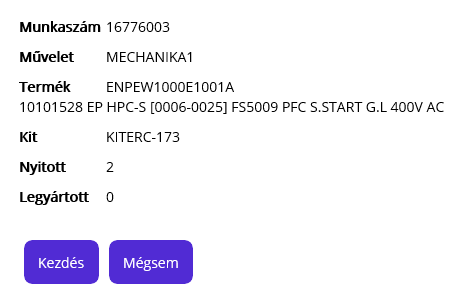

# Művelet megkezdése

A papírnyomtatás során minden kész és félkész termékhez készül egy visszajelentő oldal

Ezen szerepelnek auz üzemi gyártási lista műveletei.

A műveletet végző dolgozónak egy ilyen papírral kell a visszajelentő konzolhoz mennie.

## Bejelentkezés

A dolgozónak azonosítania kell magát. Ehhez a kapott vonalkódot kell beolvasnia.

Bejelentkezés után láthatja a nevét és az elérhető funkciókat.

## Kijelentkezés

Ha mégsem akarunk műveletet indítani a piros gombbal tudunk kijelentkezni

## Visszajelentés -  művelet megkezdése

A visszajelentés gombbra kattintva a rendszer bekéri a z üzemi megbízáshoz tartozó művelet számát.
Ez tartalmazza vonalkód formájában a visszajelentés papír.

Ha beolvastuk a műveletet, a program egy összesítő oldalt jelenít meg, ahol leellenőrizhetjük, hogy jó műveletet választottunk e ki.

A mégsem gombbal kiléphetünk a kezdés gombal pedig elkezdhetjük a műveletet.

## Automatikus kijelentkezés

A raktári jogokkal nem rendelkezőknél a program automatikusan kijelentkezik, mert a gépnél a dolgozónak nincs további teendője.

