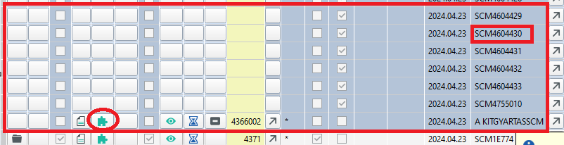
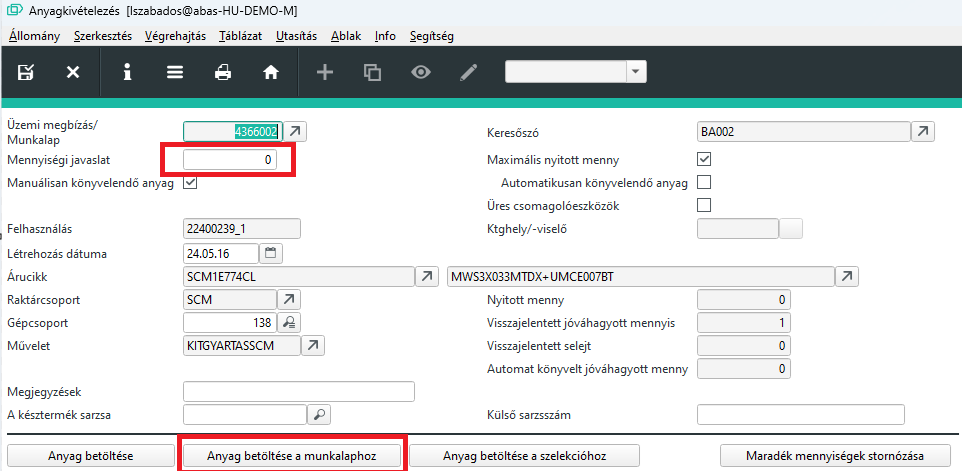
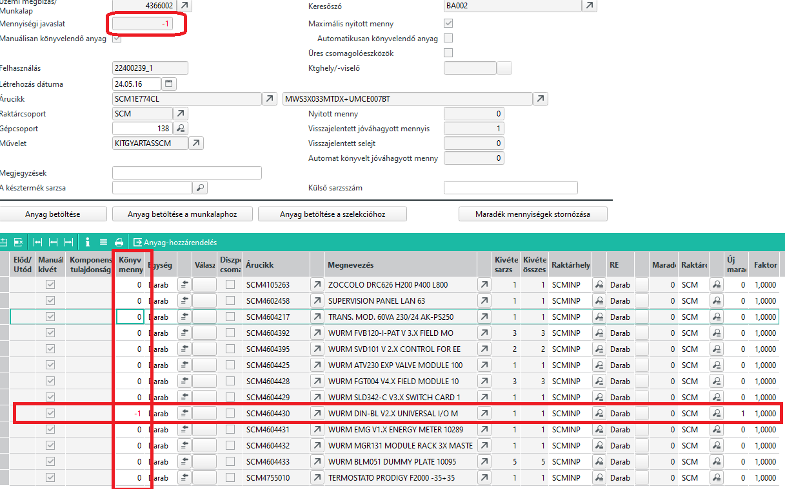

# Szétszerelés

Az ABAS rendszernek van kifejezetten szétszerelés funkciója, de azt akkor kell alkalmazni, ha a teljes készterméket (kész vagy félkész állapotról) szétszedjük, mert visszavonták a megbízást.

A legtöbb esetben csak egy egy alapanyagot akarunk kivenni, mert például a teszt során hibásnak bizonyult.

Ennek az eljárásnak a menete a következő az E.R.C. Kft-nél.

## Feltételek és igények felmérése

Első körben azt vizsgáljuk meg, hogy érdemes e a kiszerelést az ABAS-al dokumentálni.

Ha a hibás alapanyag van raktárkészleten szabadon és azonnal fel tudjuk használni, akkor nem kell a kiszerelést és utána az ismételt anyagfelhasználást az ABAS-al rögzíteni.

Ha az alapanyagból nincs szabad készlet a cseréhez, akkor az ABAS-nak is meg kell mondani a kiszerelés tényét, hogy az alapanyag visszakerüljön raktárkészletre. Enélkül nem tudnánk a szállítónak szállítólevélen visszaküldeni.

## Eljárás ha van csere alkatrész raktáron

A szabad készletből a SELEJT raktárhelyre át kell raktározni a szükséges mennyiséget. Fizikailag a hibás alapanyagot kell oda tenni, a jót pedig beszerelni.

Kész is van!

## Eljárás ha nincs cserealkatrész raktáron

Ebben az esetben az ABAS-al ki kell vételezni a panelból az alapanyagot.

Legegyszerűbben a Gyártásközponton keresztül, megkeressük azt az üzemi megbízást, ahol az alapanyag szerepel a gyártási listán

> Az üzemi megbízás száma a panel kísérőlapján szerepel, a visszajelentő lapon

Az alábbi példában a 4366 üzemi megbízás SCM46000430 alkatrészét szeretnénk kiszerelni!
Látjuk, hogy az alkatrészt követő 002-es művelet "A KITGYARTASSCM" ami az anyagkivételezést összefogja. Ennek a sornak az anyagkivét gombjára kell kattintani.

Fontos, hogy tudjuk, minden esetben az alapanyag alatti első műveletnél lévő anyagkivét gomb ami nekünk kell!

Nagyon fontos, hogy itt most a kész vagy félkész termék anyagkivét lapját fogjuk látni. Azért fontos ezt megérteni, mert a Mennyiségi javaslatánál nem azt a mennyiséget kell megadni, amennyit ki akarok szerelni a panelból, hanem hogy hány panelból akarom kiszerelni. Pl. Ha van 3 panel és mindből ki kell szerelni 2 db-ot, akkor itt 3-at adok meg, mert 3 panelből szerelem ki.

Mivel itt nem anyagkivételezés (Raktárrról -> panelba), hanem anyag visszavételezés (Panelból-raktárra) történik, ezért a "Mennyiségi javaslat" mezőbe negatív számot írunk! Ezután, az "Anyag betöltése a munkalaphoz" gombbal az ABAS betölti az alapanyag listát.

A "Könyvelt mennyiség" oszlopban az ABAS előre kitölti a maximális (negatív) mennyiséggel, mintha mindent ki szeretnénk venni. Ezért írjunk minden sorban 0-át, kivéve ott, ahol valóban ki akarunk szedni.
Az "Új maradék" oszlopban esetünkben 1 lesz a sornál, ezzel jelezve, hogy ennyi hiányunk lesz a panelban, ami jó.

> kérem vegyétek figyelembe, hogy az új maradék oszlopban esetleg lehet máshol is érték, ahol még hiány van valóban, ezt nem szabad módosítani!

Mentés esetén az alapanyag visszakerül arra a raktárhelyre, ami a gyártási listán kivét helynek van beállítva.

Amennyiben vissza kell szállítani, akkor a szállítólevélen kivét raktárhelynek ezt kell megadni, ha selejt, akkor innen kell átraktározni a selejt raktárhelyre.

> Mindenképpen vagy vissza kell szállítani vagy a selejt raktárhelyre átraktározni, hogy az ABAS ne akarja ismételten felhasználni a kivett alapanyagot. Ezt lehetőleg a kivétel után azonnal csináljuk meg. Ha a visszaszállítás későbbre van időzítve, akkor raktározzuk át a selejt raktárhelyre és onnan szállítózzuk vissza.

