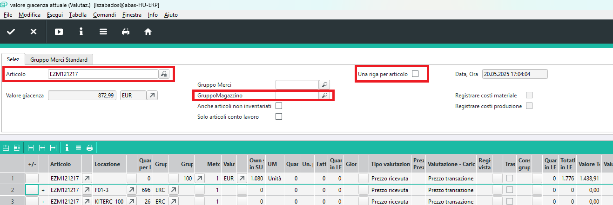
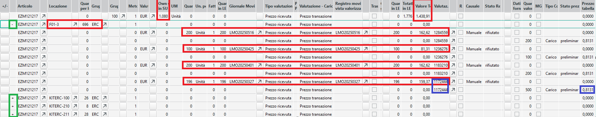

# Interrogazione attuale delle scorte

## Infosystem per il valore attuale del magazzino (valutazione)

Per interrogare le scorte di magazzino è disponibile un infosystem che tiene traccia delle scorte al loro valore di acquisto.

Infosystem: 10396 LAGERWERTAKTUELL

- Possiamo filtrare per un articolo specifico o per tutti gli articoli.
- Possiamo richiedere che il risultato venga mostrato in una riga per articolo, in questo caso i prezzi di acquisto vengono mediati.
- Possiamo specificare un gruppo di magazzino specifico.

Mostra il valore di acquisto delle scorte presenti in tutti i luoghi di magazzino.

> Nel caso di articoli di produzione propria, il valore di acquisto degli articoli è il costo reale di produzione, basato sulle dichiarazioni di produzione. Cioè:
 - il valore di acquisto delle materie prime dichiarate,
 - il costo di produzione degli articoli di produzione propria dichiarati,
 - il costo del lavoro delle operazioni,
 - i costi delle operazioni (macchinari).
 In pratica, il valore del calcolo a consuntivo viene riportato qui come valore di acquisto.

### Esempio di utilizzo

Interroghiamo l’articolo EZM121217.

La prima riga mostra la scorta totale e il valore totale della scorta. Solo in questa riga è compilata la colonna del gruppo articolo.

Dalla seconda riga vediamo le quantità per luogo di magazzino. All’inizio delle righe troviamo i segni "+" o "-". Con il pulsante davanti al segno "+" possiamo espandere i dettagli, con il segno "-" possiamo chiuderli.

Se apriamo i dettagli, ogni ricezione viene visualizzata su 2 righe. In una vediamo la quantità ricevuta e il valore totale, nella seconda il prezzo unitario.

> L’intera lista può essere esportata in Excel e filtrando le righe si possono visualizzare solo i riepiloghi o solo i dettagli.

> Se nella richiesta abbiamo selezionato di ricevere il risultato in una riga per articolo, non è possibile filtrare per articolo. In questo caso non vediamo nemmeno i luoghi di magazzino, quindi nel valore delle scorte sarà incluso anche il materiale già trasferito in produzione ma non ancora dichiarato come utilizzato.

> È consigliabile richiedere separatamente da ABAS a quale magazzino appartiene ciascun luogo di magazzino, e in Excel associare queste informazioni alle righe per poter filtrare le scorte dei magazzini di produzione.

