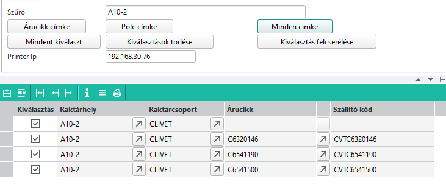
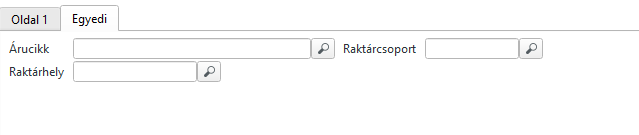
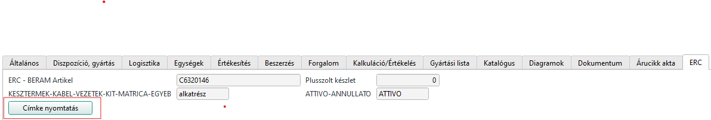
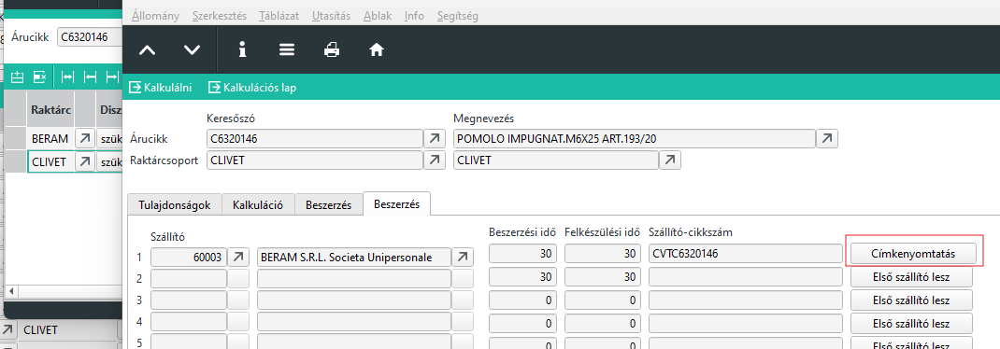

# Árucikk és Polc címke nyomtatás Infosystem

ZEBRAPLATZ Infosystem futtatásával lehet indítani közvetlenül, vagy a Céges/ERC/Raktár/Polc és árucikk címke menüponttal.

## Szűrési feltétel

Szűrő mezőbe minden esetben raktárhelyre keresünk.
Szűrési feltételnél használhatunk helyettesítő karaktereket.

* bármilyen karakter
^ ezzel kezdődik, vagy ezzel végződik utasítás
pl:
A   - Minden A betűvel kezdődő raktárhely
*A  - Minden A betűt tartalmazó raktárhely
*14^ - Minden 14-re végződő raktárhely

## Címkék listázása

### Polc címkék

A szűrési feltételnek megfelelő polc címkéket a "Polc címke" gomb megnyomásával lehet listázni.

### Árucikk címkék

A szűrési feltételnek megfelelő raktárhelyeken található árucikkek címkéit az "Árucikk címke" gombbal lehet listázni.

### Minden címke

A "Minden címke" gombbal a szűrési feltételnek megfelelő polc címkéket kapjuk, de minden polc címke alatt az összes a polcon megtalálható árucikk címke is listázásra kerül.

## Nyomtatandó címkék kiválasztása

Alapértelmezetten minde sor kinyomtatásra kerül.

Az első oszlopban lévő jelölő törlésével kivesszük a sort a nyomtatásból.

A fejrészben lévő gyorsgombok segítségével lehet minden kijelölni, minden kijelölést törölni, vagy a kijelölés megfordítésát kérni.

## Nyomtatás

Az IP cím megadásával jelölhetjük ki a nyomtatót.
A START gombbal a nyomtatás azonnal elindul, és minden kijelölt címke nyomtatásra kerül.

## Árucikk címke nyomtatás raktárhelytől függetlenül

Az egyedi fülön megadható egyetlen árucikk vagy raktárhely.
A raktárcsoport megadása kötelező, alapértelmezett érték a belső raktárcsoport (ERC).

Ha az árucikket töltjük ki akkor árucikk címke,
ha a raktrhelyet töltjük ki, akkor a Polc címke nyomtatódik ki. 

Ha bármelyik ki van töltve, a táblázatos rész figyelmen kívül lesz hagyva és törlődik!

## Árucikk címke nyomtatás raktárhelytől függetlenül Árucikk MASK-ról

Árucikket belső raktárcsoporthoz az árucikk MASK ERC fülén a "Címkenyomtatás" gombbal lehetséges.

Külső raktárcsoporthoz a címkét a raktárcsport tulajdonságok megnyitásával és a megfelelő raktárcsoport kiválasztásával a Beszerzés fülön az elsődleges szállító végén a Címkenyomtatás gombbal lehetséges.

> A címkére a raktárcsoporton kívül az elsődleges szállító cikkszáma is rákerül, amennyiben ki van töltve.

> A nyomtatás előtt megkérdezi biztosan nyomtatni szeretne e. Alapértelmezetten a NEM lehetőség van kiválasztva. Ez azért van, hogy véletlenül ne tudjuk nyomkodni és címkéket nyomtatni.

> A funkció kifejezetten a raktár számára készült a nyomtató fixen be van állítva, csak oda lehetséges nyomtatni.

