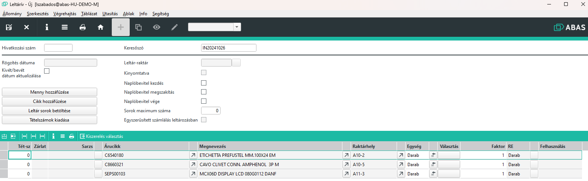
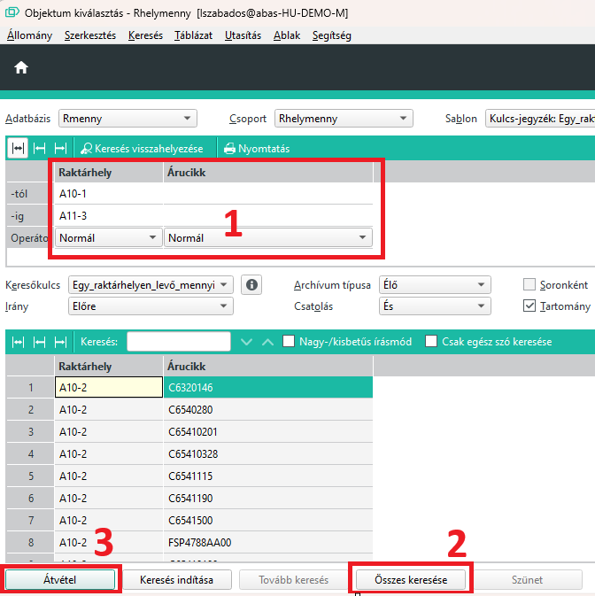
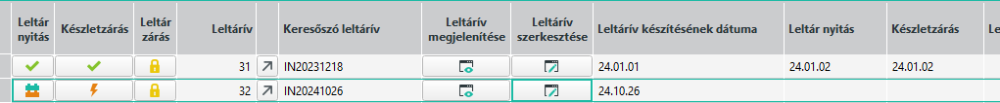
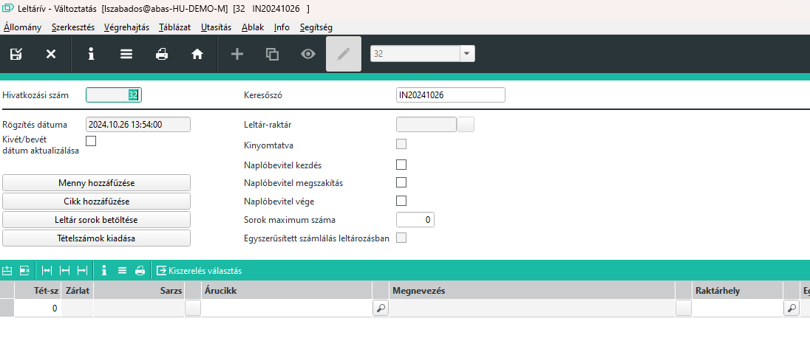
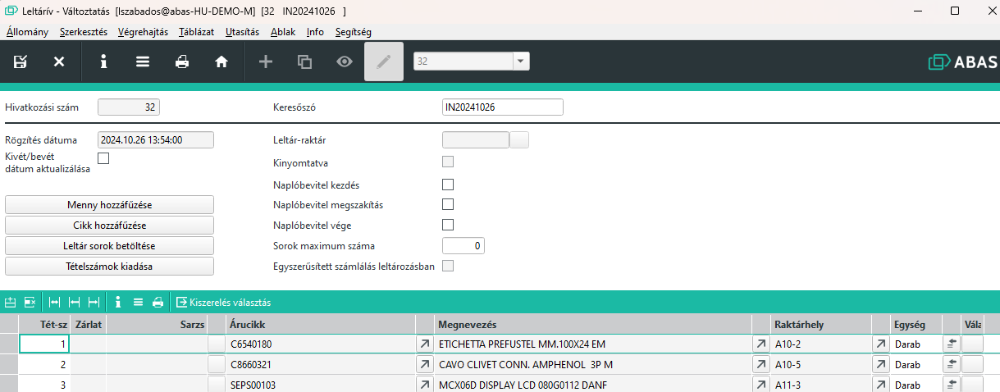

# Leltárív

Az ABAS rendszerben a leltáríven írjuk elő, hogy mit leltározunk és hol.

A használatához olvassa el a [Leltározás folyamata](leltarozas-folyamata.md) leírást.

A leltáríveknek egyedi sorszáma van, ezzel tudjuk azonosítani.
Leltáríveknek van megyitási és lezárási dátuma. E dátumok között az érintett tételekben nem szabad raktármozgást végezni.
A leltárívekre kézzel, külső adatforrásból vagy szelekcióval tudunk leltár sorokat feltölteni.

Egy sor kötelezően tartalmaz egy 
- raktárhelyet, amit letározunk,
- árucikket, amit megszámolunk

Egy ilyen raktárhely-árucikk páros, csak egyetlen egyszer szerepelhet a leltáríven. 

Ez alól a kivételek azok az esetek, amikor az árucikkeket a raktárhelyen belül is valamilyen további azonosítóval megkülönböztetünk, egyedivé tesszük.
Ilyen tovbbi azonosítók:
- sarzs, ha van sarzskezelés, sarzsonként kell az árucikkeket számolni
- felhasználás, ha van felhasználás az árucikkhez, akkor az egy felhasználási számmal rendelkező árucikkeket külön kell számolni
- faktor, ha az árucikk felvételekor faktort is beállítottunk, akkor nyilván az 100-as faktorral rendelkező árucikk pont 100 szoros mennyiséget jelöl, ezért azt külön kell számolni.

> Fontos, hogy a sorok duplázását nem csak leltáríven belül figyeli a rendszer. Más nyitott leltáríveken sem szerepelhet ugyan ilyen sor. A rendszer ezzel akadályzza meg, hogy ugyan azt a raktárhelyet több különböző leltárívekre felvegyük, ezért ezeket a mennyiségeket duplán számoljuk.

## leltárívek állapotai

A leltárívek különböző állapotban lehetnek. Ezek egymást követő állapotok, visszalépni nem lehet.

### Kezdeti állapot

Ebben az állapotban lehet a letárívekere a sorokat felvenni, elkészíteni, nyomtatni a leltáríveket.

Ezt a leltár elkezdése előtt körültekintően el lehet végezni.

> A leltározás folyamata nem aktív, lehet készletmozgás az érintett raktárhelyeken

### Nyitott leltárív

Nyitott leltárív állapotban elkezdődött a leltározás, lehet rögzíteni a megszámolt mennyiségeket és amennyiben akarjuk a tételekhez tartozó árakat is.
Új sorok felvétele is megengedett, amennyiben valamiért nem került fel az árucikk-raktárhely páros a kinyomtatott leltárívre.

Lehetőség van leltárkülönbözeti lista nyomtatására is amennyiségek rögzítése után.

### Készletzárás megtörtént

Készletzárás után mennyiségi változtatásra már nincs mód, és a sorokat sem lehet bővíteni.
Készletzárás után lehet az értékelési árakat módosítani, valmint leltárkülönbözeti listát értékelési árakkal nyomtatni.

Ezt követően újból szabad készletmozgással járó tevékenységeket végezni.

### Leltárzárás megtörtént

A leltárzárással a leltárív archiválásra kerül, bármi okból megnyitni, nyomtatni, stb az archívumból lehet.

## Leltárív szerkesztése

### Leltárív sorainak feltöltése

A "Menny hozzáfűzése" gombbal egy szelekciós ablak jelenik meg.

Raktárhely és/vagy árucikk tartományok megadásával tudunk keresni.

> Érdemes korábban eldönteni, mely raktárhelyek ekrülnek egy leltárívre és ezeket a raktárhelyeket leszűrni. Ha a raktárhelyek elnevezése szerencsés volt, akkor itt most tartomány szerűen lehet listázni.

Az összes keresése gombbal megkapjuk az eredményt, amit az Átvétel gombal tudunk átadni a leltárívnek.

A kapott leltárívet mentsük el.

### Leltárív megnyitása szerkesztésre

A leltárközpontban a létrehozott leltárívet a leltárív szerkesztése gombbal tudjuk megnyitni változtatás céljából.

A megnyitott leltárív viszont egy üres táblázatot mutat, nincsenek sorok.

A sorokat a "Leltár sorok betöltése" gombbal egy szelekcióval tudjuk betölteni.

"Összes keresés" -> "Átvétel" után a sorok megjelennek.

### További sorok felvitele a leltárívre

Ha megnyitunk szerkesztésre egy leltárívet és betöltjük a sorokat, nem működik a "Menny hozzáfűzése" nyomógomb, csak kézzel tudunk új sorokat felvinni.
Ez viszont egy újabb raktárhely tartomány rögzítése esetén fáradságos munka lenne.

A megoldás, hogy a leltárív megnyitás szerkesztésre művelet után ne töltsük be a sorokat. Üres táblázat esetén engedi a "Menny hozzáfűzése" gombbal újabb raktárhely tartomány kiválasztását és átvételét. Elmentjük. Újbóli megnyitás és sorok betöltése után már összefűzve látjuk az összes sort.

### Sorok törlése a leltárívről

Szerkesztésre megnyitott leltárívnél töltsük be a sorokat. Töröljük a törlendő sorokat, majd mentsünk.