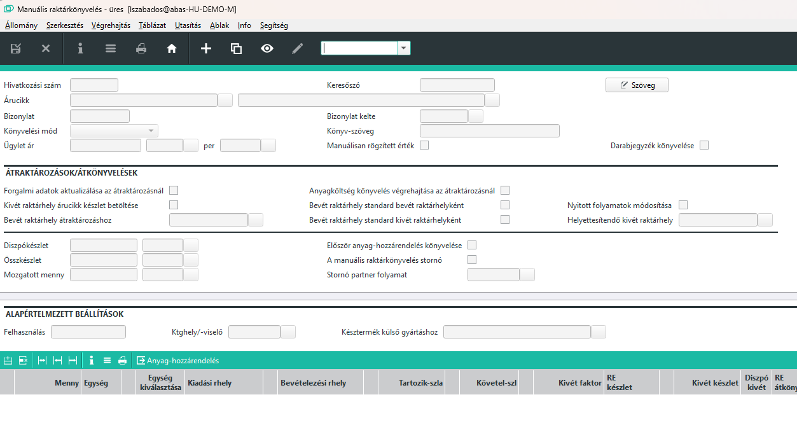
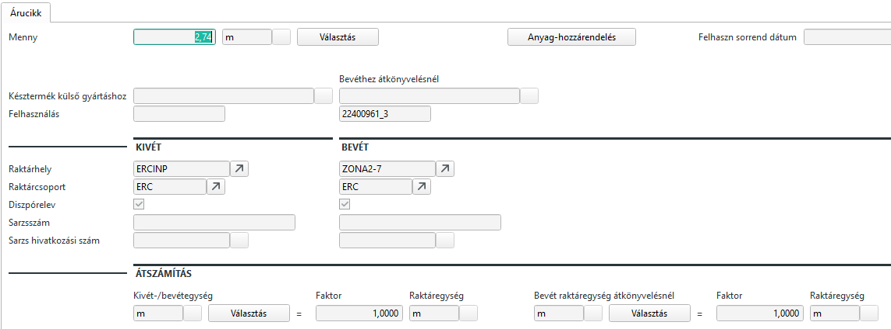

# Manuális raktárkönyvelés

ABAS rendszeren belül a manuális raktárkönyveléssel tudunk bejövő készletet rögzíteni, kimenő készletet rögzíteni és átraktározni.

Speciális eseteket kivéve Bejövő vagy kimenő készletmozgást nem készítünk, mivel ezeket a mozgásokat szállítólevéllel végezzük.

Raktáron belül viszont alapvetően átraktározásokat hajtunk végre.

> Ezt a funkciót hívja meg a PDA-n elérhető [Átraktározás](atraktarozas.md) funkció is, de itt szélesebbek a lehetőségek.

Átraktározásnál csak új felvitelre van lehetőség. 
Kötelezően az árucikket, könyvelési módot és a bizonylat keltét kell megadni, valamint a táblzatos részt tölteni.

Meg kell adni a mennyiséget a kiadási és a bevételezési helyet.

> Javasolt a bizonylat sor kitöltése is, ahol hivatkozhatunk a mozgás okára.

Sornagyítóval elérhető további lehetőségként a Sarzs vagy a felhasználás megadása is.

>  Ennek segítségével lehet pl. egy árucikkhez felhasználást rögzíteni, ahol a kivét és a bevét raktárhely ugyan az, de a bevét felhasználást kitöltjük. Ugyan így lehet pl sarzs esetén is eljárni.

Mentés esetén az átkönyvelés megtörténik.

Részletesebb információkért nézze meg az ABAS súgót.

