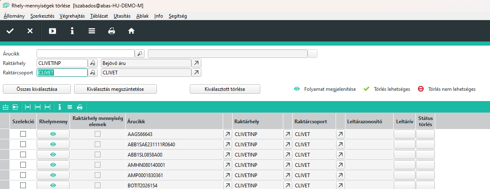
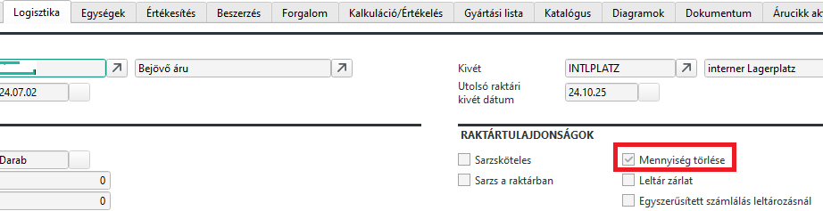
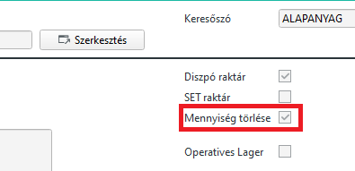

# Nulla készlettel rendelkező mennyiségek törlése

0 készletű raktárhely mennyiségek betöltése és törlése
Ha vannak okok, hogy miért nem lehetséges a törlés, akkor az ok átláthatóvá kerül tételre.

Az infosystem fejrészében kiválasztási kritériumokat írhat be a raktárhely mennyiségek szelekciójához, pl. egy bizonyos árucikkhez. Ha az azonos nevű mezőben beír egy raktárhelyet, akkor megjelenítésre kerül a hozzá tartozó raktárcsoport a megfelelő mezőben.

Az adatok a Start nyomógombra való kattintás után kiadásra kerülnek a táblázatban. Hajtsa végre a kiválasztását egyenként vagy válassza ki az összes rekordot az Összes kiválasztása nyomógombbal! A Kiválasztás megszüntetése nyomógombbal egy lépésben visszavonhatja a táblázat komplett kijelölését. A Kiválasztottak törlése nyomógombbal törölheti a kiválasztottakat.

A Raktárhely mennyiség mezőben egy kattintással megjeleníttetheti a folyamatot. Megtekintheti pl. a készletet és hogy rendelkezésre állnak-e raktárhely mennyiség elemek.

Ha rendelkezésre áll leltár azonosító, akkor lehívhatja a hozzá tartozó leltárívet.

A Törlés státus mező azt jeleníti meg, hogy a raktárhely mennyiség törlése lehetséges-e vagy sem.

## Nulla készletű mennyiség tiltása

Van lehetőséh, hogy az ABAS ne tárolja a 0 készletű mennyiséget. Ehhez két beállítás szükséges.

1. Engedélyezni kell az árucikknél, hogy ne tároljuk a nulla készletet.

2. Engedélyezni kell a raktárban, hogy ne tárolja a nulla készletet.

Itt fontos észre venni, hogy csak abban nem tárolódik a nullás készlet, ha az árucikknél és a raktárnál is engedélyezve van a nullás készlet törélse.

> A már nullás készlettel rendelkező tételek esetében hiába állítjuk át ezeket a kapcsolókat, nem törlődik a nullás készlet. Ha viszont töröljük, ismételeten nem jelenik meg újból.

