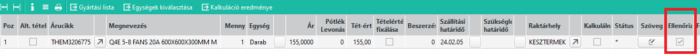

# Ajánlatok ellenőrzése

A tervezési részleg a késztermék és a késztermék gyártási listájának elkészítését végzi alapfeladatként.

## Késztermék adatai

A késztermék keresőszavát és raktáregységét már rendszerint létrehozták, enélkül nem lehetne az ajánlatra tenni a sort. Ha mégsem létezne létre kell hozni.

A két alap értéken kívül további beállítások is szükségesek, ami a készterméket érinti. Lásd [Áricikk](../torzsadatok/cikkek.md) leírást.

A készterméket létre lehet hozni egy másik, hasonló termék másolásával is, és akkor már csak a különbségeket kell javítani.

Ennek segítésére készült a [Késztermék másolása](kesztermek-masolasa.md) infosystem.

### Gyártási lista

Vagy már létezik gyártási listája a terméknek, vagy új termék esetén nincs neki. A tervezési részlegen a megbízótól kapott tervek alapján a gyártási listát el kell készíteni, vagy ki kell javítani. 

Amennyiben a gyártási listára olyan cikk kell ami még nincs a rendszerben, a cikket létre kell hozni és erről írásban értesítenia többi érintett részleget.

Pl. A beszerzési osztály fogja az új árucikk paramétereit beállítani. A legfontosabbak: beszállító, szállítási határidő, árcsoportot, ár.

Szintén a beszerzési osztály tudja eldönteni, hogy az árucikket a vevőtől kapjuk (conto lavoro) vagy saját beszerzés e. Ez fontos, hiszen ez indokolhat külső raktárcsoport beállításokat és a tervezésnek más gyártási listára kell az árucikket tennie.

Ha talál lilas sorokat a gyártási listán (ANNULLATO), akkor azt is kezelni kell. Lásd: [Gyártási lista](gyartasi-lista.md)

Ha készen van, ellenőrzést kell futtani : [Gyártási lista ellenőrzés](gyartasi-lista-ellenorzes.md). A hibák többségét a beszerzési osztály tudja javítani, ezért ha van, őket kell írásban kérni a javításra.

Lásd még: 
- [Gyártási lista](gyartasi-lista.md)
- [Gyártási lista ellenőrzés](gyartasi-lista-ellenorzes.md)
- [Késztermék másolása](kesztermek-masolasa.md)
- [Összesített előkalkuláció](osszesitett-elokalkulacio.md)
- [Külső raktárcsoport váltása](kulso-raktarcsoport-valtas.md)
- [Cikk cseréje gyártási listán](cikk-csereje-gyartasi-listan.md)

Ha elkészült a javítás, az árajánlat maskon könyvelni kell, az Ellenőrizve mező beállításával. 

Ez különösen akkor hasznos, ha sok tétel van az ajánlaton, így tudja a technikus, mely sorok ellenőrzésével végzett.