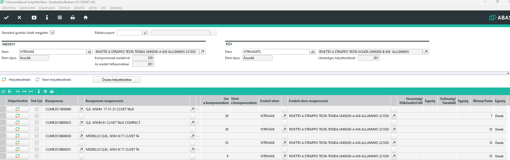
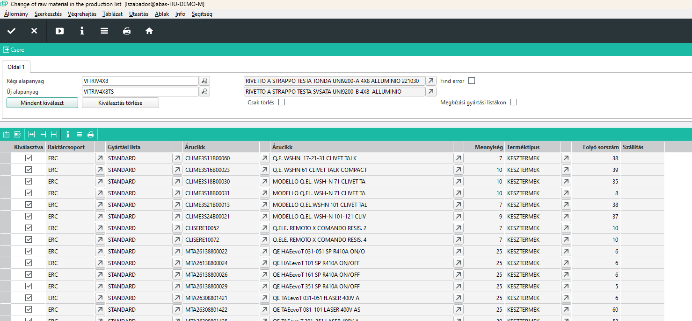

# Cikk cseréje gyártási listán

Erre a funkcióra két Infosystem is rendelkezésre áll.

## Felhasználsáok helyettesítése

ABAS gyári Infosystem. 

Meg kell adni a lecserélendő és az új elemet.

A futtatás után az összes gyártási lista amin a ciik szerepel felsorolásra kerül.

Szűrési lehetőség csupán a raktárcsoport és kihagyhatóak a nem standard gyártási listák.

### ABAS standard program hátrányai

- Minden listázott elemen cseréli, nem lehet választani.
- Nem lehet csak törölni

## Felhasználások helyettesítése ERC

A program ugyan úgy a régi és az új alapanyagot kéri be. Futtatáskor listázza a talált gyártási listákat és azon az érintett sort.

Az első kiválasztás oszloppal van lehetőségünk kiválasztani, hol cserélünk.

A CSERE gombbal a csere végrehajtódik.

### Csak törlés

Ha a csak törlés mezőt beállítjuk, akkor csak régi alapanyagot kell megadni, és ekkor nem csere hanem törlés történik.

### Megbízási gyártási listák

A megbízsi gyártási listák adatbázis szerkezete teljesen eltér a normál gyártási listáétól, hiszen ott már a gyártás soránkeletkező plusz informácikat is tárolni kell.

Ez a program ezeken a gyártás alatt lévő gyártási listákon is képes alapanyagot cserélni, amennyiben még nem történt felhasználás visszajelntés az alapanyagra.

Használatához állítsuk be a "Megbízási gyártási listákon" mezőt.

A gyártási lista oszlop ennél a módnál üres, hiszen nem létezik gyártási lista azonosító, a gyártási lista a gyártási javaslat részeként létezik az üzemben.
