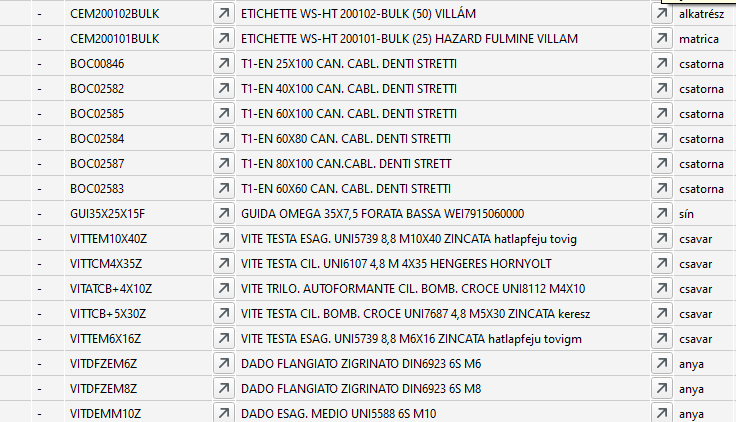
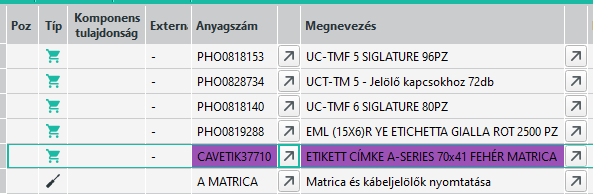
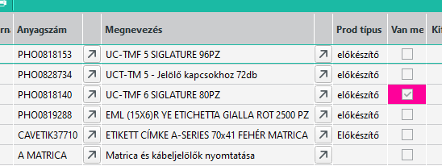

# Gyártási lista

Gyártási lista készítését a tervezés részleg végzi.

A gyártási cikkeket (lehet alapanyag vagy félkész termék), műveleteket illetve gyártóeszközöket is tartalmazhat.

## Műveleti sorrend

Az ABAS abból indul ki, hogy felsoroljuk a beépülő cikkeket és utána jön a művelet, ami elvégzése során a cikkeket felhasználjuk.

Ez a műveleti sorrend nem csak a cikke és műveletek sorrendiségét határozza meg, hanem az ABAS úgy gondolja, a cikkek is olyan sorrendben kerülnek beépítésre, ahogyan az fel van sorolva.

> Ez a tulajdonság a rendelkezésre állás számolásánál jelentkezik látványosan, amit a [Gyártási központ](../gyartas/gyartasi-kozpont.md) infosystemben lehet látni.

A gyártási lista műveleteit sorrendben kell elvégezni, de bizonyos beállításokkal megenged korlátozottan párhuzamosságot a rendszer.

A beszúrt műveletek Átment oszlopában két lehetséges érték lehet. Vége vagy Kezdés.

|Beállítás|Leírás|
|---|---|
|Kezdés|Az átmeneti idő egyidejűleg kezdődik a művelettel. Így 2 művelet fut párhuzamosan, az átfutási idő lerövidítésre kerül.|
|Vége|Az átmeneti idő a művelet befejezésekor kezdődik. Így egy művelet az előző művelet befejezése után kezdődik.|

## Műveletek időzítése

A műveletek 2 legfontosabb paramétere, az előkészületi idő és a darabidő.

Az előkészületi idő, az az idő, amíg a műveletek elkezdéséhez felkészülünk. Pl, beállítjuk a gépet, bevűzzük az anyagot, feltöltjük a tartályt, stb..
A darabidő az egy művelet elvégzésének az ideje.

Az ABAS lehetőséget ad rá, hogy az előkészületi időt más bércsoport beállítással vegyük fel. Ez akkor kell, amikor pl a gép beállítását egy technikus végzi, az előkészületi időben, de a gyártást már egy normál dolgozó. Ez az elő és utókalkulációt befolyásolja.

## Szállítási és pihenő idő, Puffer idő, Átmeneti idő; Időegység

Ezekben a mezőkben egy munkadarab 2 művelet közötti szállítási és pihenő ideje kerül megjelenítésre, valamint a puffer idő a következő művelethez. Az adatok ehhez az árucikk semleges gyártási listájából kerülnek átvételre. A diszpozíció a durva tervezésben ezt a 3 időt figyelembe veszi. A mezőbevitelek módosíthatók; a következő műveletek ennek alapján a következő diszpófuttatásnál eltolásra kerülnek. A puffer idő a durva tervezés során nem komprimálható.

A szállítási idő az az idő, amire egy munkadarab 2 gyártási hely közötti mozgatásához van szükségünk. Munkaórában és munkanapban kerül megadásra. A pihenő idő, pl. egy munkadarab szárításához vagy hűtéséhez, órában vagy naptári napban adható meg, mivel a folyamat lefuthat az üzemi munkaidőtől függetlenül.

Ha használatra kerül az APS rendszer (Advanced Planning and Scheduling), akkor a puffer idő komprimálható.

Az átmenet típusa azt adja meg, hogy hogyan kerül kezelésre az átmeneti idő a puffer, szállítási és pihenő idő összegeként a diszpozíció során. Az átmeneti idő az 1. művelet végén vagy az 1. művelettel párhuzamosan helyezhető el.

## Hibaletőség párhuzamosan futó műveleteknél

Ha olyan műveletek vannak, ahol az Átmenet Kezdetre van állítva, előfordulhat, hogy a második művelet előbb fejeződik be, mint az azt megelőző. Ez náha hibás idő kalkulációhoz velet. Amennyiben engedjük a párhuzamos műveleteket, akkor próbáljunk arra törekedni a sorrendiséggel, hogy a sorrendben előbb felsorolt művelet előbb is fejeződjön be.

## Félkész termékek definiálása

Olyan esetekben, ahol a prhuzamos munkavégzés lehetséges és nem meghatározható a műveletek kezdési és befejezési sorrendje egymáshoz viszonyítva, ott érdemes külön félkész terméket létrehozni és annak külön gyártási listáját. Ekkor a többi gyártástól valóban függetlenül végezhető a munkavégzés, és az elkészült félkész termék, mint cikk kerül a fő termék gyártási listájába.

## Árucikk hosszúság, szélesség mennyiség

Legtöbb esetben a beápülő cikkek mennyisége darab és ígypontosan megadható a szükséges mennyiség.
Ha az árucikk darabban van meghatározva és az árucikk mask egységek fülén az Átszámítás/Gyártás nincs kitöltve, akkor a gyártási listában csak a mennyiség adható meg, a szélesség és hosszúság mező írásvédett.

Amikor egy cikk pl. 2 méteres rúdban van, akkor a raktár darabban tárolja, pl 5 db 2 méteres rúd. Tárolhatja méterben is, ekkor 10 méter van a cikkből.

Ennek ellenére, mivel a cikk adott méretű, a cikk egységek fülén az Átszámítás gyártás részen, be kell állítani, hogy például 
2000mm hosszú, 0mm széles = 1 db
vagy
2000mm hosszú, 0 mm széles = 2 méter

> A szélesség azért 0, mert nem kell értelmezni ebben az esetben. Ha egy lemez pl. 2000mmx1000mm lenne, akkor ott érdemes a szélességet is megadni.

Ezzel a beállítással 2 dolgot érünk el.

1. a gyártási listán a hosszúság mező tölthető, vagyis megadható, hogy a gyártáshoz 600mm hosszú kellebből a termékből.
2. a gyártási listán megadható a használat mezőben, hogy egy ilyen termékből hány árucikkhez elegendőt tudunk kiszolgálni. Esetünkben a 2000mm hosszú rúdból 3x600mm vághatóki, és marad 20mm. De az már nem használható fel. Ha gyártanunk kell 10 árucikket, ahhoz 10x600 mm rúd kell, és ehhez 4 rúdra lesz szükség.

Ezek a beállítások rendkívül fontosak az anyagtervezéshez, mert a fenti példánál, ha csak a hosszat nézzük 10x600mm az 6 méter és az 3 rúd lenne. De a gyakorlatban 4 kell. És ha a beállítás nem megfelelő, a beszerzés kevesebbet rendel, és anyaghiány keletkezik a gyártásban.

## Gyártóeszközök

A gyártóeszközök felvehetők a gyártási listákba, de nem tartoznak a diszpozíció hatáskörébe. A gyártóeszközök kezelésének fontos aspektusa a minőségellenőrzés.

Az anyagköltség könyveléssel az elő- és utókalkuláció nem vesz figyelembe gyártóeszközöket. Az értékük nem folyik be a saját gyártású cikkek átlagárába. A kalkulációs eredményekben a gyártóeszközök és árucikkek ugyan még dokumentálásra kerülnek a táblázatban, azonban 0 értékkel és költségnem nélkül.

## Termék típusa

A gyártási lista Prod típusoszlopában szövegesen megjelenik az árucikk csoportba sorolása.

Részletekért nézd meg az [Árucikk](../torzsadatok/cikkek.md) leírást.

Ez az információ segít a technikusnak, hogy a cikket melyik gyártási listára tegye.

## Kifutó/Új tételek

Amennyiben olyan árucikk van a gyártási listán, ami kifutónak van jelülve, ott az árucikk duplázódik. Egymás alatt a régi és az új cikk. Ha az egyiket töröljük, a másik is törlődik, mert együtt érvényesek.

Miért van 2 soron? A kifutó árucikket lehetséges még egy meghatározott ideig beszerezhető, és ennél tovább felhasználható. Pl. a meglévő készletet fel akarjuk használni, de ha elfogy, onnantól az újat használjuk.

A gyártási lista még nem üzemi gyártási lista, nem tudni ebből mikor lesz gyártás, és nem tudjuk, akkor mekkora készlet lesz a régi termékből, és hogy akkor még ez felhasználható e. Ez a bizonytalanság miatt mindkét terméket látjuk, mert vagy ez vagy az.

Amikor gyártásba kerül a termék, akkor a készletek figyelembevételével az ABAS kiválasztja, hogy még a régi készletből, vagy már az új árucikkből gyártunk e. Vagyis ott már csak az egyik árucikk fog szerepelni, de leőre nem megmondható melyik.

## ANNULLATO

Az ERC fülön egy ATTIVO/ANNULLATO jelölést adhatunk az árucikknek. 
Ha olyan cikk van a gyártási listán, ami ANNULLATO beáll jtással van, akkor a cikk sora lila lesz, jelezve, hogy az árucikk esetleg nem használható.

Ez a jelölés a tervezésnek jelzi, cserélni kellene a cikket és a Beszerzési osztálynak, hogy ne rendelje.

Az ANNULLATO jelentése kb ugyan az mint a kifutó árucikknek. Miért van mégis erre szükség.

Számos esetben egy kifutó árucikk abból keletkezik, hogy a gyártó megszünteti a terméket és egy másikat gyárt helyette. A másik terméknek amit a gyártó ajánl helyette, nyilván nem teljesen ugyan az mint az előző.

A készülő termékbe vagy bele tudjuk teeni a javasolt helyettesítő terméket, vagy nem. Ez tervezést, egyeztetést igényel.

Ebből adódik, hogy ha egy termék kifut, hiába van helyettesítő termék, nem biztos, hogy egyszerűen erre mindenhol le lehet cserélni az előzőt.

Az ANNULLATO-val jlölt soroknál a tervvezés a rektárral tudja egyeztetni, hogy még gyártható e a készletből, vagy sem. A késztermék tervezőjével/megrendelőjével lehet egyeztetni, hogy a helyettesítő termék megfelelő e, és ha nem, mi legyen helyette.

Ha cserélni kell, akkor a [Cikk cseréje gyártási listán](cikk-csereje-gyartasi-listan.md) leírás alapján a cikk cserélhető ahol kell.

## Szöveg

A tervezés néha magának, néha a gyártásnak a gyártási listába kitölti a tételszöveget. 

Ha beírunk valamit, akkor a "Van megjegyzés" oszlop színnel és pipával is jelzi.

