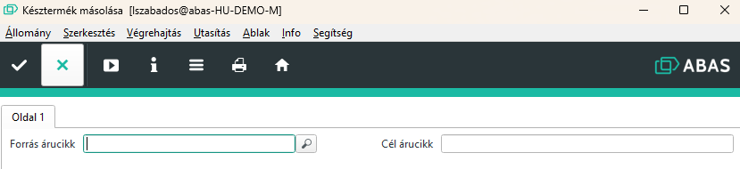
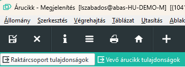

# Késztermék másolása

Késztermék másolása egy nagyon kicsi program, de a háttérben sok feladatot elvégez.

## Használata

Két paramétert vár a program
1. Forrás árucikk. Ennek léteznie kell, ezért ki kell választani
2. Cél árucikk. Ez nem létezhet, meglévő árucikket nem tudunk felülírni a programmal.

Indítás után a másolás megkezdődik. Ha az eredeti árucikknek volt vevő árucikk tulajdonság beállítva, megkérdezi a rendszer az új értéket, felajánlva a régit. Néha a revíziók a vevőnél azonos cikkszámon vannak, ezért nem kell változtatni, de amikor a vevő is ad másik számot, akkor nem szabad megfeledkezni az átírásról, ezért a program mindenkéépen rákérdez, ha volt ilyen.

------
------
------

## Elmélet az árucikk másolásáról

Az ABAS tartalmaz minden MASK-on egy másolás gombot, amivel le tudunk egy objektumot másolni.

Árucikkek esetében viszont az alábbi probélmák merülnek fel.

1. Az ABAS nem másolja a cikk Raktárcsoport tulajdonságait és Vevő árucikk tulajdonságait

2. Gyártási listán a félkész termékek a fő termékhez kapcsolódó egyedi termékek. Az ABAS másoláskor lemásolja a gyártási listát, de az eredeti késztermék félkész termékeit hagyja bent.

Példa: Van egy THEM3206186 késztermék
Ennek az alábbi félkész termékei vannak:
- THEM3206186BIL
- THEM3206186MAT
- THEM3206186CAV
- THEM3206186FIL
- THEM3206186CL

Ráadásul a THEM3206186CL terméknek vannak külső raktárcsoport beállításai, és ott van a ContoLavoro gyártási lista.

Ha az ABAS másolással lemásoljuk a készterméket pl. THEM3206186 ből THEM3206187 lesz, akkor a THEM3206186 félkész termékei lesznek a gyártási listában, és a THEM3206187 -hez nem is jönnek létre a félkész termékek.

## Mit végez el a program

1. Késztermék lemásolása THEM3206186 -> THEM3206187 néven
2. Félkész termékek másolása THEM3206187BIL, THEM3206187MAT, THEM3206187CAV, THEM3206187FIL, THEM3206187CL (gyártási listával együtt)
3. A THEM3206187 gyártási listáján a THEM3206186 félkésztermékeket cseréli THEM3206187 félkész termékekre
4. A THEM3206187CL külső raktárcsoportot létrehozza és a THEM3206186CL alapján átveszi az értékeket. A külsőraktárcsoporton lévő gyártásilistát is másolja.
5. Ha van vevő árucikk tulajdonság, akkor létrehozza, de bekéri a vevő azonosítót, feltételezve, hogy az új termék a vevőnél is másik kódon szerepel.

## Mitnem végez el a program

Az új termékhez nem hoz létre árlistát

