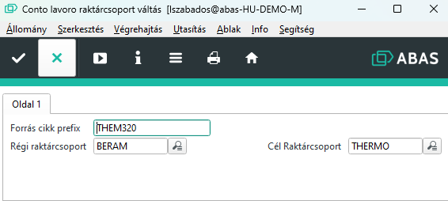

# Külső raktárcsoport váltás

Külső raktárcsoporton a Conto Lavoro alapanyagokat tároljuk. Erre azért van szükség, mert 

Az E.R.C. valójában 2 típusú ContoLavoro alapanyagot kap. Az E.R.C. szempontjából elvileg nincs különbség közöttük, de mégis meg szeretnénk különböztetni.

1. Olyan conto lavoro alapanyag, amit a vevő ad.
2. Olyan conto lavoro alapanyag, amit a BERAM vesze meg.

Van olyan vevő, aki nem ad alapanyagot, de a BERAM igen. Itt nem kell a vevőnek külső raktárcsoportot létrehozni, hiszen ezek a CL alapanyagok mind a BERAM tulajdona.

Viszont időnként előfordul, hogy változnak a körülmények és a vevő úgy dönt, az alapanyagok egy részét ő adja. Ebben az esetben érdemes, a vevő tulajdanának külön tárolása miatt, külön raktárcsoportot létrehozni a vevőnek.

## Gyártási lista éa a raktárcsoport kapcsolata

A gyártási listáknak van egy raktárcsoport tulajdonsága. Ez a tulajdonság viszont, csak egyetlen egyszer, a gyártási lista létrehozásakor állítható be, utána már nem módosítható.

Ebből következik, hogy meglévő gyártási listát nem rendelhetjük át meásik raktárcsoportba. Amikor gyártási listán raktárcsoportot szeretnénk váltani, akkor a meglévő gyártási listát le kell másolni, és ekkor a mentés előtt át lehet állítani a raktárcsoportot.

## Gyártási lista elemeinek raktárcsoport beállítása

Nem csak a gyártási listának, hanem az azon szereplő alapanyagoknak is kell külső raktárcsoport beállításának lennie. Amennyiben ilyen beállítás nincs, az ABAS alapértelmezetten a belső raktárcsoportból fogja az igényt kielégíteni, és ha ott nincs, akkor erre a beslő raktárcsoportra fogja az alapanyagokat rendelni.
Ez nyilván nem jó, ezért minden egyes alpanyag esetében le kell ellenőrizni a raktárcsoport beállítás meglétét.

## Raktárcsoport specifikus műveletek

A műveleteknek kötelezően egy adott gépcsoporthoz, a gépcsoportnak pedig egy adott részleghez kell tartoznia. A részleg viszont egy raktárcsoportthoz tartozik.

Emiatt az egyes külső raktárcsoportoknál ugyan arra a műveletre, külön művelet sort kell létrehozni. pl: KITGYARTASCLIVET, TITGYARTASMTA, stb..

Fontos, hogy a gyártási lista lemásolása után, ezeket a műveleteket is cseréljük le a raktárcsoport szerinti megfelelőre.

## Infosystem segítség

A Conto lavoro raktárcsoport váltás" infosystem ezen feladatok nagy részét elvégzi egy vagy több terméken.

ELindítva az alábbi MASK nyílik meg:

A régi és az új raktárcsoport egyértelmű.

A Forrás cikk prefix, valójában egy cikkódot vár. Ha egy konkrét késztermék keresőszavát írjuk ide, akkor annak a cikknek fogja elvégezni a conto lavoro váltását.
Ha nem a teljes cikkszámot írjuk be, akkor minden cikkre ami a mezőben beírt szöveggel kezdődik, megcsinálja a váltást.
Pl.: Ha beírjuk THEM320, akkor minden késztermék, ami THEM320-al kezdődik, átalakításra kerül.

> A program nem végzi el a másolást, ha az adott termékhez már van a cél raktárcsoporton bármilyen gyártási listája

> A régi gyártási lista nem törlődik, viszont a *CL végű, contolavoro kit raktárcsoport beállításaiból a régi raktárcsoport törlődik és csak az úja marad meg.

