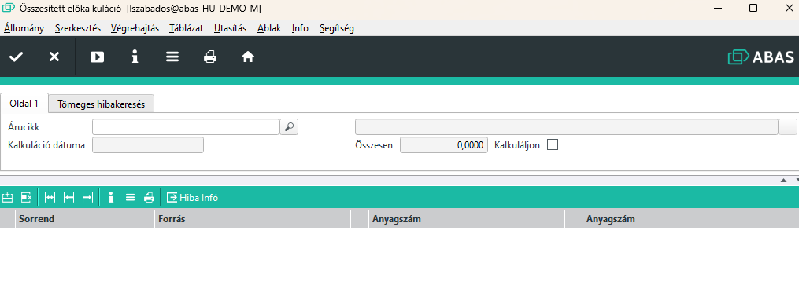
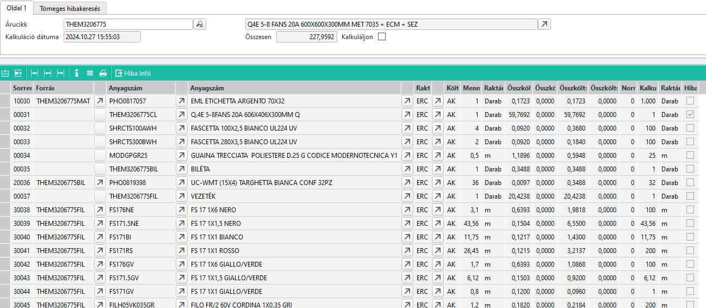
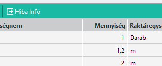
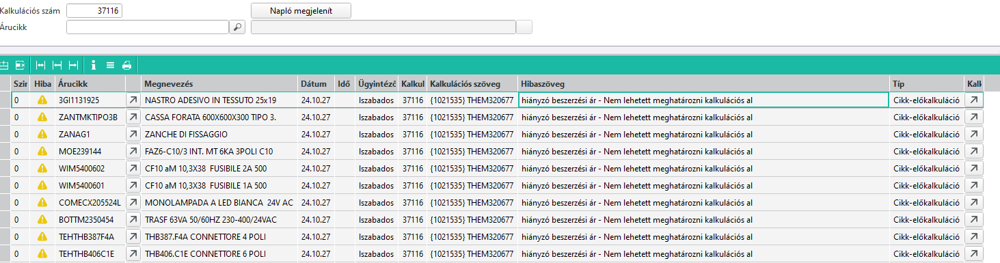
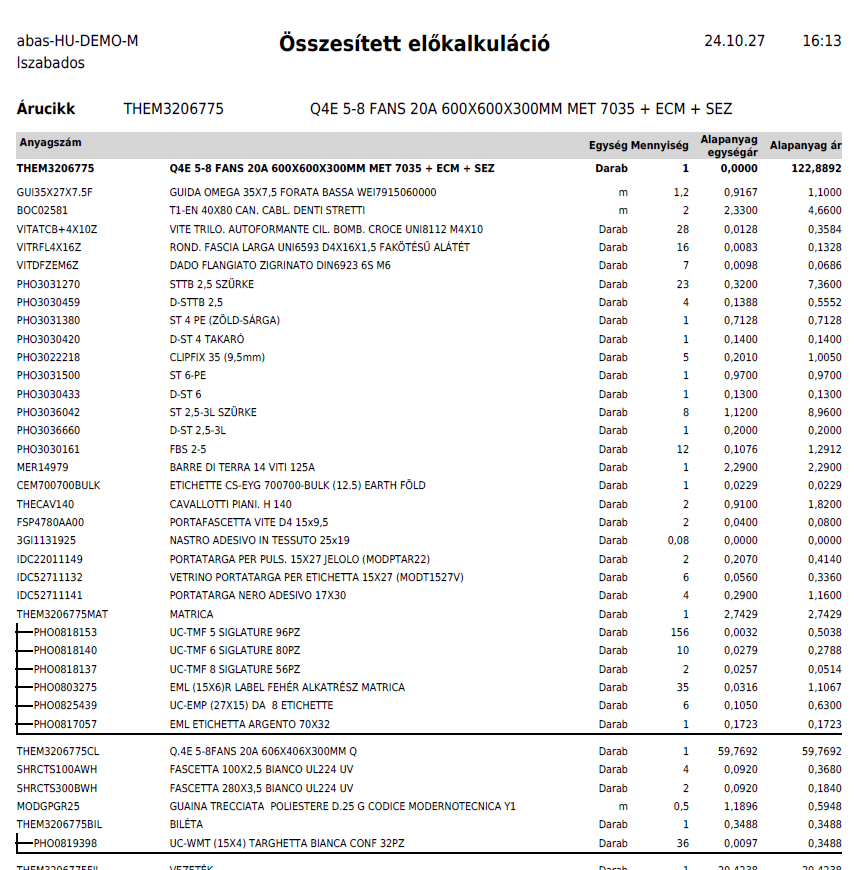
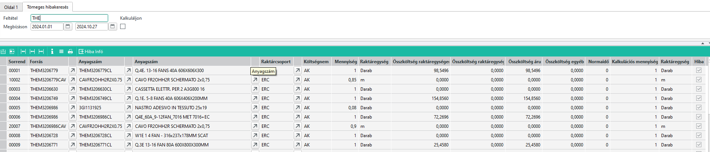

# Összesített előkalkuláció

Az összesített ekőkaluláció az ABAS előkaluláció funkcióját egészíti ki.

Az ABAS-nak nagyon jól működő előkalkulációs rendszere van, viszont amennyiben a késztermék félkész termékeket is tartalmaz, azok előkalkulációit csak összesítve kapjuk meg.
Ha a tervező kíváncsi a félkész termék részletes kalkulációjára, a félkész terméket külön meg kell nyitnia és ott elvégezni az előkalkulációt.

Ezt egyszerűsíti az Összesített előkalkuláció infosystem.

Bemenőparaméternek meg kell adni a késztermék árucikket.

A Kalkuláljon mező alapból nincs bejelölve. Ha így futtatjuk a programot, akkor az eredményként a már létező, korábban futtatott előkalkulációt látjuk, feltéve, ha volt.

> Itt előfordulhat egy nehezen észrevehető hiba. Ha a készterméknek van előkalkulációja de pl. a FIL félkész terméknek nincs, akkor kapunk eredményt látunk sok sort, de mivel a FIL félkész terméknek nincs, ezért annak eredménye sem kerül a listába. Ha ezt nem vesszük észre, hibás adatokat kaphatunk!

Ha a Kalkuláljon mezőt beállítjuk és így futtatjuk, akkor új friss előkalkulációt végez az ABAS.

> Fontos, nem csak a késztermékre, hanem az összes beépülő félkész termékre elvégzi az előkalkulációt.

A futtatás után az alábbihoz hasonló eredményt kapunk

Oszlopok jelentése:
- Forrás: értéke üres, ha a késztermék gyártási lista soráról van szó. Ha nem üres, akkor annak a félkész terméknek a keresőszava, amelynek a gyártás listáján szerepel az árucikk.
- Anyagszám: Az árucikk a gyártási listáról
- Raktárcsoport: az anyag kivételezési raktárcsoport
- Költségnem: csak AK értéke lehet, ez az összesítő csak az anyagköltségeket mutatja
- Mennyiség: az egy termék előállításához szükséges mennyiség raktári egységben
- Összköltség raktáregységenként: ez egy raktáregységhez tartozó beszerzési ár
- Összköltség áru: a készermék előállításához szükséges áru értéke. (Egységár szorozva darabszámmal)
. Kalkulációs mennyiség : Az a mennyiség, amivel az ABAS számol az ár meghatározásakor
. Raktáregység: a kalkulációs mennyiség raktáregysége
- Hiba: bejelölve, ha a kalkulációs sor hibákat tartalmaz

Ha olyan táblázati sorra állunk, ahol a Hiba be van álítva, akkor a táblázati rész feletti gombsoron a "Hiba infó" gombbal megnézhetjük az ABAS hibaüzeneteit.

## Eredmény nyomtatása

Az előkalkuláció Layoutot választva hasonló nyomatot kapunk:

## Tömeges hibakeresés

Az előző funkció nagyon hasznos konkrét késztermék előkalkulációjához, ami csak az anyagköltségeket elemzi.

Az előkalkuláció viszont számos esetben tartalmaz hibákat, amelyek rendszerint valamilyen hibás vagy nem pontos árucikk paraméterezés következménye.

Ezen hibák tömeges kiszűrésére kéeszült a második fül az programon, a Tömeges hibakeresés.

Feltételnek meg kell adni egy árucikk keresőszavára vonatkozó feltételt. A feltétel az ABAS [Helyettesítő karakteres](../egyeb/helyettesito-karakteres-kereses.md) keresési konvencióit használja.

a Megbízáson sor két dátumot (tól, ig) kér. A rendszer átnézi a két dátum közötti megbízásokat és ezen megbízások összes táblázati sorát. Minden megrendelt késztermékre, ami a feltételnek is megfelel, lefuttatja az előkalkulációt, és azokat a sorokat, amelyek kalkulációs hibákat tartalmaznak, kilistázza.

Az alábbi példánál a THE-vel kezdődő készterméke kerülnek keresésre amire a megadott időintervallumban volt megbízás.

> Ne féljünk, ha túl sok hibasorunk van eredményül. A hibák száma valójában jóval kevesebb, mivel egy árucikk ami hibás annyiszor ismétlődik, ahány gyártási listán szerepel.
Vagyis egy árucikket egyszer javítunk, a többi helyen is meg fog oldódni a probléma.

